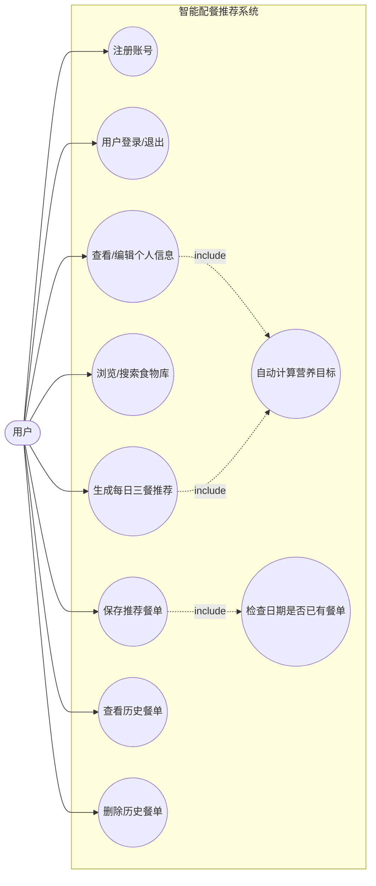
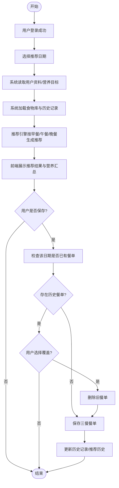

# 第1章 需求分析

## 1.1 背景

### 1.1.1 软件系统名称
- **软件系统名称**：智能配餐推荐系统（Smart Meal Recommendation System）
- **系统形态**：本地运行的 Web GUI 应用（浏览器作为客户端，C++ 轻量 HTTP 服务器作为后端）
- **核心目标**：面向个人用户，根据基础身体信息与活动水平计算每日营养目标，并自动生成三餐配餐建议，支持保存与历史追踪。

### 1.1.2 任务提出者、开发者、用户与运行环境
- **任务提出者**：专业系统能力实训课程（任课教师/课程组）
- **开发者**：项目组（第7组，团队协作完成需求分析、设计、实现与测试）
- **最终用户**：
  - 课程验收与演示场景：授课教师、同学、评审人员
  - 实际使用场景：有饮食管理需求的普通用户（如减脂/增肌/维持体重人群）
- **运行载体（计算机中心/网络环境）**：
  - **单机本地部署**为主：Windows 10/11 个人电脑
  - **网络**：本机回环或局域网访问（默认端口 `8000`，浏览器访问 `http://localhost:8000`）
  - **数据存储**：本地 `data/` 目录下文本文件（轻量级文件数据库）

### 1.1.3 与其他系统/机构的基本交互关系
- **与外部系统的关系（当前版本）**：
  - 系统不依赖外部在线服务；食物库、用户、餐单均保存在本地文件中，离线可用。
- **与其他机构/平台的潜在关系（可扩展方向）**：
  - 可对接公共营养数据库/第三方食物成分库（如 CSV/REST API 导入）
  - 可与健康设备/运动平台联动（导入运动消耗、体重变化等数据）
  - 可与校园/食堂菜单系统做数据交换（自动生成更贴近可获得食材的推荐）

---

## 1.2 进行可行性研究的方法

本项目可行性研究采用“**需求调研 → 建模分析 → 风险评估 → 原型验证 → 评价决策**”的综合方法，主要策略如下：

1. **调查法（需求获取）**
   - 对目标用户（同学/身边用户）进行访谈与问卷调查，确认典型痛点：
     - 不知道每天该吃什么；
     - 很难估算热量与三大营养素（蛋白/碳水/脂肪）；
     - 需要记录历史餐单便于复盘。

2. **用例驱动法（需求结构化）**
   - 通过用例图拆分核心业务（注册/登录/营养目标/推荐/保存/历史/食物库），形成“可实现的最小闭环”。

3. **加权评分法（技术方案比较）**
   - 从学习成本、实现周期、可演示性、运行环境约束等维度，对技术方案进行加权评估：
     - 后端：C++17 + httplib（轻量、易部署）
     - 前端：原生 HTML/CSS/JS（无额外框架依赖、便于展示）
     - 数据：文本文件存储（适合课程规模，降低 DB 运维成本）

4. **基准点与原型法（验证可行性）**
   - 以“浏览器能打开 → 登录成功 → 获取用户信息 → 生成推荐 → 保存并在历史中可见”为关键基准点（Benchmark），通过可运行原型快速验证核心路径。

5. **风险识别与仿真验证**
   - 对推荐算法的合理性、数据一致性、会话管理等进行风险分析；
   - 通过样例数据初始化、重复推荐抑制策略等方式进行行为仿真与迭代验证。

---

## 1.3 技术条件方面的可行性

### a. 在当前限制条件下功能目标能否达到
- 课程项目对并发量、数据规模要求不高；
- 目标聚焦“个人推荐与历史管理”的闭环，功能边界清晰；
- 采用本地文件存储，避免数据库部署与运维复杂度。

### b. 利用现有技术功能目标能否达到
- C++17 能满足性能与工程化需求；
- `httplib` 单头文件 HTTP 服务端可快速提供 REST API 与静态资源服务；
- 浏览器端使用原生 JS 调用 API，技术成熟，跨浏览器兼容性较好。

### c. 对开发人员数量与质量要求及可满足性
- 建议最小团队配置（3~5人）：
  - 后端开发（接口/算法/数据持久化）
  - 前端开发（交互/UI/可视化）
  - 测试与文档（用例/验收/报告/演示）
- 课程团队通常具备 C++/Web 基础，学习成本可控，可满足开发要求。

### d. 在规定期限内能否完成
- 系统采用轻量技术栈、模块化设计：
  - 可分阶段交付：接口先行 → UI 联调 → 推荐策略迭代 → 文档完善
- 在课程周期内完成并通过验收具备可行性。

---

## 1.4 基本建设投资

> 说明：本项目为课程实践，优先使用现有设备与开源软件；以下为“可交付运行环境”的估算。

| 类别 | 主要内容 | 预算估算（元） | 备注 |
|---|---|---:|---|
| a. 房屋与设施 | 教室/实验室现有工位 | 0 | 使用学校资源 |
| b. ADP设备（计算设备） | 开发/运行 PC（i5/16GB/SSD） | 0~6000 | 多数同学自带或实验室提供 |
| c. 数据通讯设备 | 局域网/Wi-Fi | 0 | 校园网 |
| d. 环境保护设备 | 无特殊需求 | 0 | — |
| e. 安全与保密设备 | 本地账户权限、数据备份介质 | 0~200 | U 盘/移动硬盘可选 |
| f. 操作系统与应用软件 | Windows 10/11、浏览器、VS2022 | 0 | 教育版/社区版 |
| g. 数据库管理软件 | 不使用传统 DBMS（文本文件存储） | 0 | 降低成本 |

---

## 1.5 社会因素方面的可行性

### 1.5.1 法律与合规可行性
- **版权与许可证**：项目引用第三方库（如 `httplib`）需遵循其开源许可证；课程项目不进行商业分发时风险较低。
- **隐私与数据保护**：系统保存用户基础信息（年龄、身高体重等），应在文档中声明数据用途；当前实现为本地存储、离线运行，降低泄露风险。

### 1.5.2 组织管理与人员素质可行性
- 系统界面为 Web 交互，操作方式贴近日常使用习惯（登录/表单/按钮）；
- 用户只需掌握基本浏览器操作即可使用；
- 对管理员要求低：单机部署，维护仅涉及文件备份与程序启动。

---

## 1.6 结论

综合技术、时间、经济与社会因素分析：
- **结论：可以立即开始进行（a）**。

理由：
- 技术方案成熟且易部署；
- 需求闭环清晰，可分阶段完成；
- 课程实践资源与周期满足开发需要；
- 本地化存储与离线运行降低合规与运维成本。

---

## UML模型

### 1) 用例图（UML Use Case Diagram）

### 2) 活动图（UML Activity Diagram）——“生成推荐并保存”

---

## 附表格

### 表 1.1 项目范围说明书

| 项目范围说明书 | 内容 |
|---|---|
| 项目名称 | 智能配餐推荐系统 |
| 版 本 | v1.0 |
| 发布时间 | 2025-12-18 |
| 项目经理 | （填写：组长姓名） |
| 主要内容 | 项目论证 |
| 是否可实现 | 可实现（技术成熟、范围可控、可演示性强） |
| 项目产品简述 | 基于个人身体信息与活动水平，自动计算营养目标并生成三餐推荐，支持食物库浏览、历史餐单管理。 |
| 项目可交付成果总述 | 可运行程序（后端+前端）、示例数据、接口文档、实训报告、演示材料。 |
| 决定项目成功的因素说明 | 需求边界清晰、推荐算法可解释、接口稳定、UI 可用性、数据一致性与可恢复性（备份）。 |
| 其他 | 可扩展：引入更多食物数据源、加入个性化偏好/过敏源管理、支持云端存储。 |

### 表 1.2 需求分析说明书

| 项目名称 | 智能配餐推荐系统 |
|---|---|
| 项目经理 | （填写：组长姓名） |
| 总体描述 | 系统提供用户注册登录、个人信息与营养目标管理、食物库浏览检索、三餐智能推荐、餐单保存与历史查询删除等功能。 |
| 所需硬件环境描述 | Windows PC（建议 2 核 CPU/8GB 内存/可用磁盘≥500MB）；局域网或本机回环访问。 |
| 所需软件环境描述 | Windows 10/11；Visual Studio 2022（开发）；支持现代浏览器（Chrome/Edge）；C++17 运行环境（编译产物）。 |

**业务需求清单：**

| 业务需求 | 需求优先级 | 模块名称 | 功能描述 | 负责人（开发） | 负责人（测试） |
|---|---|---|---|---|---|
| BR-01 用户注册 | 高 | 用户管理 | 用户填写基础信息并创建账号，系统计算营养目标并返回会话 Token。 | 后端/前端 | 测试 |
| BR-02 用户登录/退出 | 高 | 用户管理 | 用户凭证校验，建立会话；退出清理本地 Token。 | 后端/前端 | 测试 |
| BR-03 个人信息维护 | 高 | 个人中心 | 查看与修改年龄/身高/体重/性别/活动水平，自动重算目标。 | 后端/前端 | 测试 |
| BR-04 食物库浏览与搜索 | 中 | 食物库 | 获取食物列表，支持关键词/分类过滤（前端实现）。 | 后端/前端 | 测试 |
| BR-05 每日三餐推荐 | 高 | 推荐引擎 | 根据营养目标、类别权重、偏好/避讳/过敏源与历史重复抑制生成三餐。 | 后端 | 测试 |
| BR-06 保存/覆盖保存餐单 | 高 | 餐单管理 | 将推荐结果写入存储；若指定日期已有餐单可覆盖。 | 后端/前端 | 测试 |
| BR-07 历史餐单查询 | 中 | 餐单管理 | 按用户查询历史餐单并展示营养汇总。 | 后端/前端 | 测试 |
| BR-08 历史餐单删除 | 中 | 餐单管理 | 支持按餐单 ID 删除、按日期批量删除。 | 后端/前端 | 测试 |

制定者：_________  
日  期：__________
