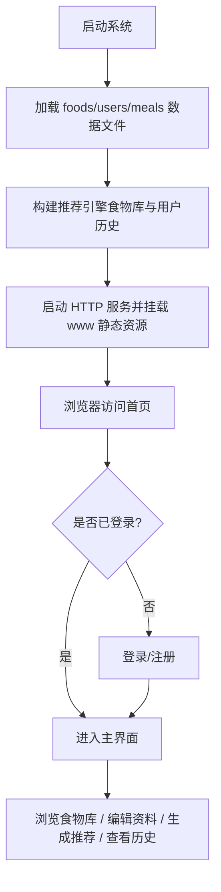
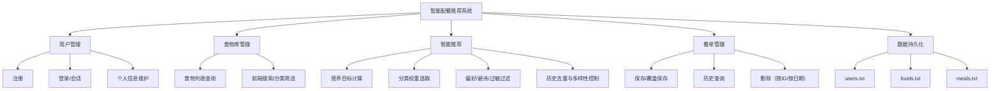
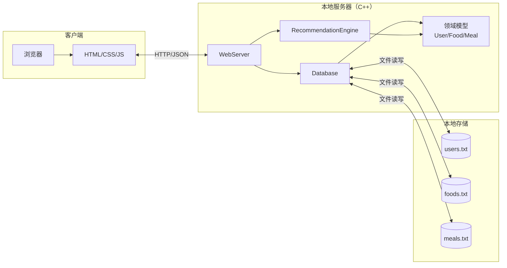
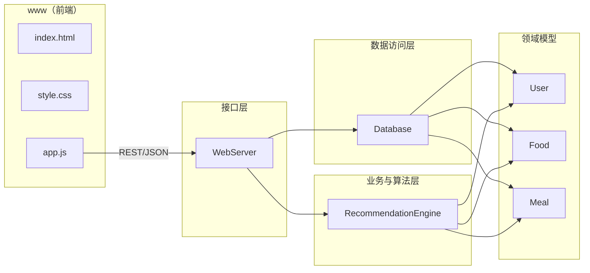
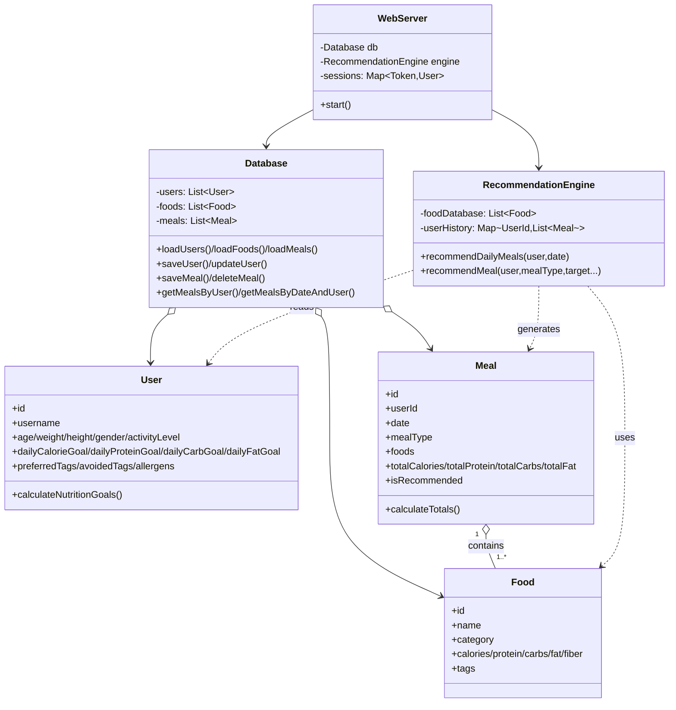
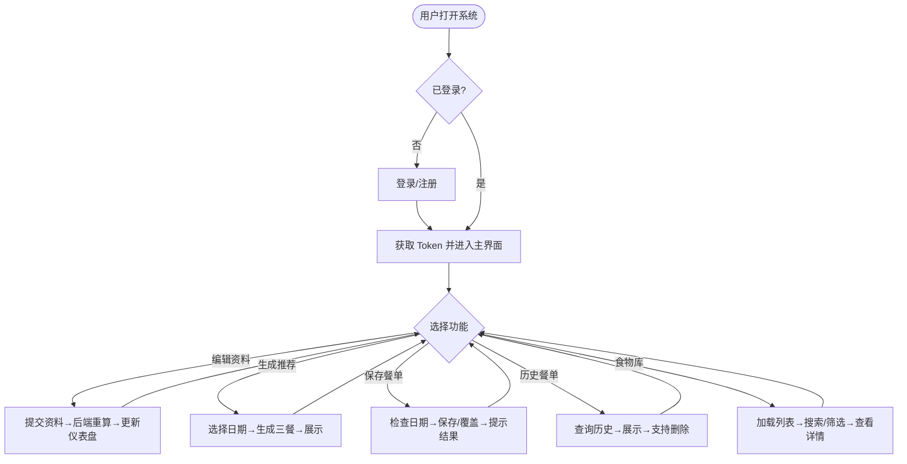
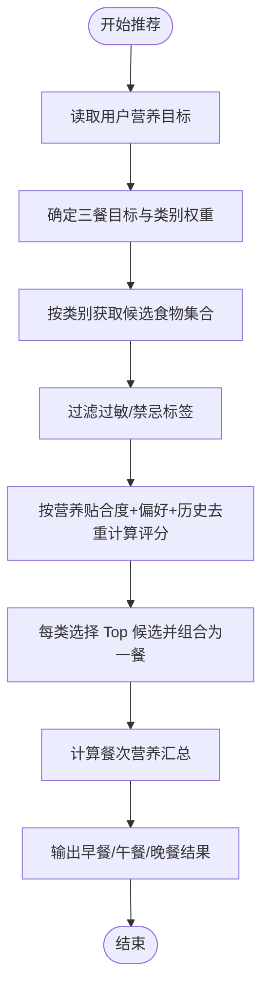
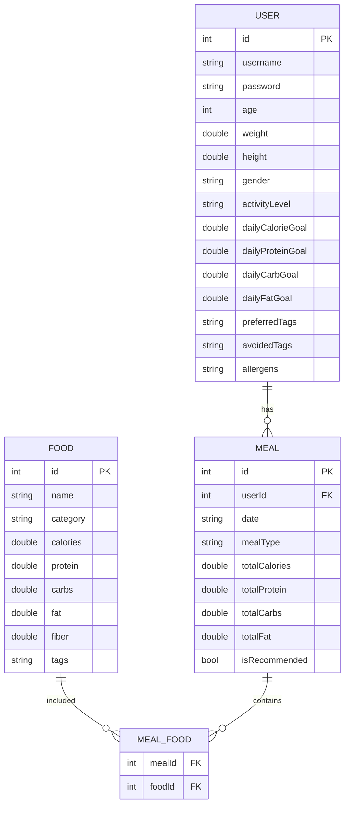

# 第2章 系统设计

## 2.1 背景

### a. 待开发软件系统的名称
- **智能配餐推荐系统（Smart Meal Recommendation System）**

### b. 任务提出者、开发者、用户与运行环境
- **任务提出者**：专业系统能力实训课程（任课教师/课程组）
- **开发者**：第7组项目团队
- **用户**：课程验收人员与普通体验用户
- **运行环境/计算中心**：
  - 本地 Windows PC 或实验室 PC
  - 浏览器作为客户端（Chrome/Edge）
  - 本地启动 C++ WebServer（默认端口 8000）

---

## 2.2 总体设计

### 2.2.1 运行环境

**硬件环境（建议）**
- CPU：双核及以上
- 内存：≥ 8GB
- 磁盘：≥ 500MB 可用空间（含构建产物与数据文件）
- 网络：本机回环或局域网（可选）

**软件环境**
- 操作系统：Windows 10/11
- 开发环境：Visual Studio 2022（或 CMake + 编译器）
- 运行环境：支持 C++17 的编译产物
- 浏览器：Chrome / Edge（现代浏览器）

### 2.2.2 基本设计概念和处理流程

**总体设计理念**
- **轻量可部署**：后端为 C++ 单体程序，启动后同时提供静态页面与 REST API；
- **模块化**：领域模型（User/Food/Meal）、数据层（Database）、算法层（RecommendationEngine）、接口层（WebServer）解耦；
- **可解释推荐**：推荐结果来自营养目标匹配、分类权重、偏好/避讳/过敏过滤与历史去重等可解释策略。

**总体处理流程（从访问到推荐）**

### 2.2.3 用户接口设计

系统采用单页式 Web 界面，主要交互与界面组成如下：

1. **登录/注册界面**
   - 输入项：用户名、密码；注册时额外输入年龄、性别、身高、体重、活动水平
   - 输出：登录/注册结果提示；成功后进入主界面

2. **仪表盘（首页）**
   - 展示：每日热量目标、蛋白/碳水/脂肪目标
   - 快捷入口：生成推荐、查看历史、浏览食物库

3. **个人信息界面**
   - 功能：查看与修改用户基本信息
   - 行为：提交后后端重算营养目标并返回最新资料

4. **智能推荐界面**
   - 输入：日期
   - 输出：早餐/午餐/晚餐推荐（食物列表）与营养汇总
   - 操作：保存/覆盖保存

5. **历史餐单界面**
   - 展示：按日期分组的历史餐单与营养统计
   - 操作：按餐单删除、按日期批量删除

6. **食物库界面**
   - 展示：食物列表（名称、类别、热量、宏量营养素、标签）
   - 搜索/筛选：关键词与类别（前端完成过滤）

### 2.2.4 系统数据结构设计（总体架构/模块划分）

#### 功能结构图（模块分解）

#### 总体架构（组件视图）

### 2.2.5 逻辑结构设计

系统核心数据对象及其关键数据项如下（逻辑视角，不涉及具体代码实现）。

#### 1) 用户（User）
| 数据项 | 含义 | 类型/格式 | 约束/说明 |
|---|---|---|---|
| id | 用户唯一标识 | int | 系统自增/分配 |
| username | 用户名 | string | 唯一，必填 |
| password | 密码 | string | 当前为明文存储（课程项目）；可扩展为哈希 |
| age | 年龄 | int | >0 |
| weight | 体重 | double | kg |
| height | 身高 | double | cm |
| gender | 性别 | string | male/female 或 “男/女” |
| activityLevel | 活动水平 | string | sedentary/light/moderate/active/very_active |
| dailyCalorieGoal | 日热量目标 | double | kcal |
| dailyProteinGoal | 日蛋白目标 | double | g |
| dailyCarbGoal | 日碳水目标 | double | g |
| dailyFatGoal | 日脂肪目标 | double | g |
| preferredTags | 喜好标签集合 | set<string> | 影响推荐加分 |
| avoidedTags | 避免标签集合 | set<string> | 影响推荐减分 |
| allergens | 过敏源集合 | set<string> | 命中则过滤 |

#### 2) 食物（Food）
| 数据项 | 含义 | 类型/格式 | 约束/说明 |
|---|---|---|---|
| id | 食物唯一标识 | int | 系统分配 |
| name | 食物名称 | string | 必填 |
| category | 类别 | string | 主食/蔬菜/肉类/蛋类/奶制品/豆制品/水果/坚果等 |
| calories | 热量 | double | kcal（按每份/每100g的系统统一口径） |
| protein/carbs/fat | 三大营养素 | double | g |
| fiber | 膳食纤维 | double | g |
| tags | 标签集合 | set<string> | 口味/属性/过敏关键字等 |

#### 3) 餐单（Meal）
| 数据项 | 含义 | 类型/格式 | 约束/说明 |
|---|---|---|---|
| id | 餐单记录ID | int | 系统分配 |
| userId | 所属用户 | int | 外键（逻辑） |
| date | 日期 | string | yyyy-mm-dd |
| mealType | 餐次 | string | breakfast/lunch/dinner |
| foods | 食物列表 | list<Food> | 多对多关联 |
| totals | 营养汇总 | double | 由 foods 计算得到 |
| isRecommended | 推荐标记 | bool | true/false |

### 2.2.6 物理结构设计

系统采用“轻量文件数据库”实现持久化：

- **存储介质**：`data/` 目录下文本文件
- **组织方式**：每行一条记录，字段使用分隔符（如 `|`、`,`）
- **访问方法**：启动时全量加载到内存；写操作以“全量覆盖写文件”实现（规模较小时更稳定）

**文件与内容概述**
- `users.txt`：用户数据与营养目标
- `foods.txt`：食物库
- `meals.txt`：餐单记录（保存的是食物 ID 列表，读取时映射到食物对象并重算汇总）

---

## 2.3 详细设计

### 2.3.1 程序系统的结构（包图、类图）

#### 包图（逻辑包/模块依赖）

#### 类图（核心类关系）

### 2.3.2 功能（以 IPO 形式概述）

| 功能 | 输入（I） | 处理（P） | 输出（O） |
|---|---|---|---|
| 注册 | 用户名/密码/年龄/身高/体重/性别/活动水平 | 校验唯一性→计算营养目标→写入 users.txt→创建会话 | Token + 用户资料 |
| 登录 | 用户名/密码 | 校验凭证→创建会话 | Token + 用户资料 |
| 更新资料 | Token + 修改字段 | 校验会话→更新资料→重算目标→写入 users.txt | 更新后的用户资料 |
| 生成推荐 | Token + 日期 | 读取用户目标→按三餐与类别权重选食物→偏好/避讳/过敏/历史去重 | 三餐推荐列表 |
| 保存餐单 | Token + 日期 + 是否覆盖 | 检查日期→删除旧餐单（可选）→生成并落库→刷新历史 | 保存结果 |
| 查询历史 | Token | 查询用户餐单列表 | 历史餐单列表 |
| 删除餐单 | Token + 餐单ID/日期 | 权限校验→删除→刷新历史 | 删除结果 |

### 2.3.3 输入项（主要输入）

- 用户注册输入：username、password、age、weight、height、gender、activityLevel
- 推荐输入：date
- 更新资料输入：age、weight、height、gender、activityLevel
- 删除输入：mealId 或 date

### 2.3.4 输出项（主要输出）

- 页面输出：HTML/CSS 渲染的表单、卡片、统计信息
- 接口输出：JSON
  - success：布尔
  - message：提示信息
  - data：业务数据（用户资料/食物列表/餐单列表等）

### 2.3.5 算法（核心算法说明）

1. **营养目标计算（User）**
   - 使用 Mifflin–St Jeor 公式计算基础代谢（BMR），再乘以活动系数得到日热量目标。
   - 三大营养素目标：
     - 蛋白：约 `1.2 g/kg` 体重
     - 碳水：约 `50%` 热量 / 4
     - 脂肪：约 `25%` 热量 / 9

2. **推荐算法（RecommendationEngine）**
   - 三餐能量分配：早餐 30%，午餐 40%，晚餐 30%（并对蛋白/碳水/脂肪做相同分配或按比例微调）。
   - 按餐次定义“类别组合与权重”（例如早餐：主食/蛋类/奶制品/水果）。
   - 对候选食物评分：
     - 过敏命中：直接过滤
     - 避免标签：扣分
     - 偏好标签：加分
     - 营养贴合度：越接近目标越加分
     - 历史去重：近期重复次数越多扣分

### 2.3.6 流程逻辑（核心业务流程图）

#### 总体业务流程图

#### 功能模块业务流程图——“推荐模块”

### 2.3.7 接口

#### 外部接口（REST API，浏览器 ⇄ 后端）

| 方法 | 路径 | 说明 |
|---|---|---|
| POST | /api/register | 注册并返回 Token、用户资料 |
| POST | /api/login | 登录并返回 Token、用户资料 |
| GET | /api/user/profile | 获取当前用户资料（需 Authorization） |
| PUT | /api/user/profile | 更新资料并返回最新用户资料 |
| GET | /api/foods | 获取食物列表 |
| GET | /api/meals/history | 获取历史餐单 |
| POST | /api/meals/recommend | 生成指定日期三餐推荐 |
| GET | /api/meals/check-date?date=YYYY-MM-DD | 检查当天是否已存在餐单 |
| POST | /api/meals/save | 保存推荐（可选择覆盖） |
| DELETE | /api/meals/by-date?date=YYYY-MM-DD | 按日期删除餐单 |
| DELETE | /api/meals/{id} | 按 ID 删除餐单 |

#### 内部接口（模块调用）
- WebServer → Database：用户/食物/餐单的增删改查
- WebServer → RecommendationEngine：推荐生成、历史加载刷新
- Database → 领域模型：实体装配与数据序列化/反序列化

---

## 2.4 数据库设计（轻量文件数据库）

### 2.4.1 概念结构设计（实体-联系）
- 实体：User、Food、Meal
- 联系：
  - User 1 —— N Meal（一个用户有多条餐单记录）
  - Meal N —— M Food（一个餐单包含多个食物；一个食物可出现在多个餐单）

### 2.4.2 逻辑结构设计（表结构）
- users（对应 users.txt）
- foods（对应 foods.txt）
- meals（对应 meals.txt）

### 2.4.3 物理结构设计
- 数据存储在文本文件；系统启动时读入内存；写入采用覆盖写保证一致性。
- 不设置传统索引；查询通过内存遍历实现（规模小、实现简单）。

### 2.4.4 数据字典设计（节选）
- users.txt：`id|username|password|age|weight|height|gender|activityLevel|calGoal|protGoal|carbGoal|fatGoal|preferredTags|avoidedTags|allergens`
- foods.txt：`id|name|calories|protein|carbs|fat|fiber|tags|category`
- meals.txt：`id|userId|date|mealType|totalCalories|totalProtein|totalCarbs|totalFat|isRecommended|foodIds`

### 2.4.5 安全保密设计
- 接口层使用 **Bearer Token** 放在 `Authorization` 请求头中，后端维护会话映射（内存 `sessions`）。
- 数据保存在本地目录，默认只对本机用户可见；可通过 OS 权限控制目录访问。
- 课程版本未实现密码哈希与加密存储；若用于真实场景，应升级为：
  - 密码哈希（bcrypt/argon2）
  - HTTPS（反向代理）
  - 数据加密与访问审计

---

## UML/模型汇总（本章）
- 功能结构图 ✅
- 总体业务流程图 ✅
- 功能模块业务流程图 ✅
- 类图 ✅
- 包图 ✅
- ER 图 ✅

### ER 图

> 注：由于系统物理存储采用文本文件，MEAL_FOOD 为概念关联表（逻辑存在，物理上以 foodIds 列表形式存于 meals.txt）。
