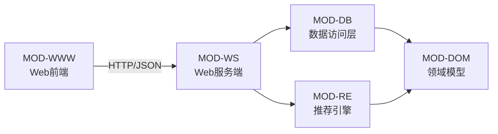
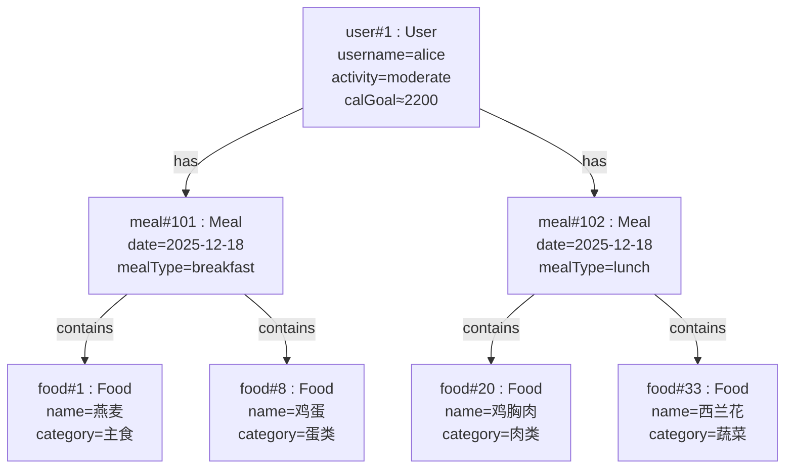

# 第3章 系统实现

## 3.1 功能说明

### 3.1.1 范围描述

**本系统实现范围（包含）**
- 用户注册、登录、会话维护（Token）
- 用户个人信息管理（年龄/身高/体重/性别/活动水平）与营养目标自动计算
- 食物库读取与列表查询（前端实现搜索/筛选）
- 每日三餐推荐生成（早餐/午餐/晚餐）
- 推荐结果保存与覆盖保存
- 历史餐单查询与删除（按餐单 ID / 按日期）

**不包含/不在本次范围（可作为扩展）**
- 在线账号体系（短信/邮箱验证）
- 云端数据库、分布式部署、权限分级（管理员/运营）
- 深度学习推荐、个性化长期模型训练
- 食物称量与摄入“真实记录”（当前为推荐与保存历史为主）

### 3.1.2 定义、缩写和术语

| 术语/缩写 | 定义 |
|---|---|
| BMR | Basal Metabolic Rate，基础代谢率 |
| TDEE | Total Daily Energy Expenditure，每日总能量消耗（BMR×活动系数） |
| 宏量营养素 | 蛋白质、碳水化合物、脂肪（Protein/Carbs/Fat） |
| Token | 用于标识登录会话的字符串（Bearer Token） |
| REST API | 基于 HTTP 的接口风格，使用 URL + 方法表示资源操作 |
| 文本文件数据库 | 使用结构化文本文件保存数据的一种轻量持久化方式 |

---

## 3.2 系统概述

### 3.2.1 模块标识符

- **软件系统名称**：智能配餐推荐系统
- **系统标识符（建议）**：SMRS-WEB v1.0

| 模块名称 | 标识符（建议） | 说明 |
|---|---|---|
| Web 前端 | MOD-WWW | 页面与交互逻辑（www/） |
| Web 服务端 | MOD-WS | HTTP 路由、静态资源挂载、会话管理 |
| 数据访问层 | MOD-DB | users/foods/meals 文件读写与查询 |
| 推荐引擎 | MOD-RE | 推荐生成、评分、历史去重 |
| 领域模型 | MOD-DOM | User/Food/Meal 数据对象 |

### 3.2.2 模块的描述性名称（模块划分与依赖）

### 3.2.3 数据结构设计（对象模型 / 对象图）

系统主要对象：User、Food、Meal。对象之间的运行时关系通常为：
- 1 个 User 对应 N 条 Meal（历史记录）；
- 1 条 Meal 包含 1..N 个 Food（餐次组成）。

#### 对象图（示例）

### 3.2.4 算法设计

#### 1) 营养目标计算算法
- **输入**：年龄、性别、身高(cm)、体重(kg)、活动水平
- **输出**：每日热量目标（kcal）与三大营养素目标（g）
- **处理步骤（概述）**：
  1. 计算 BMR（Mifflin–St Jeor）：
     - 男：`BMR = 10W + 6.25H - 5A + 5`
     - 女：`BMR = 10W + 6.25H - 5A - 161`
  2. 根据活动水平选择活动系数（如 1.2/1.375/1.55/1.725/1.9），得到 `TDEE=BMR×系数`
  3. 分配三大营养素目标：
     - 蛋白：`1.2 g/kg × 体重`
     - 碳水：`TDEE×0.5/4`
     - 脂肪：`TDEE×0.25/9`

- **复杂度**：O(1)

#### 2) 餐次推荐算法（启发式评分 + 分类权重）
- **输入**：用户目标（热量/蛋白/碳水/脂肪）、食物库、用户偏好/避讳/过敏源、用户近期历史
- **输出**：早餐/午餐/晚餐的 Meal 列表
- **处理步骤（概述）**：
  1. 将每日目标按三餐比例拆分（如 30/40/30）
  2. 对每个餐次给出“类别集合与权重”（早餐：主食/蛋类/奶制品/水果等）
  3. 对每个类别：
     - 获取候选食物集合
     - 过滤过敏源（命中直接剔除）
     - 计算评分：
       - 偏好标签加分、避免标签扣分
       - 营养贴合度（越接近类别目标越高）
       - 历史重复惩罚（近期出现次数越多惩罚越大）
     - 选择高分食物组合成餐次
  4. 对餐次计算营养汇总并输出

- **复杂度（粗略）**：
  - 设食物库规模为 N、类别数为 C：推荐单餐约 O(C×N)（遍历候选并打分）
  - 课程项目 N 较小（几十/几百），性能可接受。

### 3.2.5 接口设计

#### 1) 系统对外接口（HTTP/JSON）
- **协议**：HTTP
- **数据格式**：JSON
- **认证**：`Authorization: Bearer <token>`

主要接口（与第2章一致）：
- `/api/login`、`/api/register`
- `/api/user/profile`（GET/PUT）
- `/api/foods`
- `/api/meals/recommend`、`/api/meals/save`
- `/api/meals/history`、`/api/meals/{id}`、`/api/meals/by-date`

#### 2) 系统内部接口（模块调用）
- WebServer 调用 Database 完成数据读写与查询
- WebServer 调用 RecommendationEngine 生成推荐结果，并在保存后刷新历史

### 3.2.6 异常处理

| 异常/错误场景 | 检测点 | 处理策略 |
|---|---|---|
| 未登录/Token 过期 | 后端检查 sessions 映射 | 返回失败 JSON；前端触发 logout 并提示 |
| 参数缺失或格式错误 | 后端解析 JSON/Query 参数 | 返回失败 JSON（提示缺少 date 等） |
| 用户名重复 | 注册时校验 | 返回失败 JSON（用户名已存在） |
| 文件读取失败（首次运行） | foods.txt 不存在或为空 | 自动初始化样例数据并继续启动 |
| 删除越权 | 删除餐单时校验 meal.userId | 返回失败 JSON（无权限删除） |
| 网络异常/解析失败 | 前端 fetch/JSON 解析 | 弹出“网络错误，请重试”提示 |

---

## 3.3 实现细节

### 3.3.1 编程语言与工具
- 后端语言：C++17
- 前端语言：HTML5/CSS3/JavaScript（原生）
- IDE/构建：Visual Studio 2022（MSBuild），项目亦提供 CMake 支持
- 运行方式：启动可执行程序，自动打开浏览器访问本地地址

### 3.3.2 代码风格与规范

（以项目现有实现为准，便于团队一致性）
- C++：
  - 采用头文件声明 + 源文件实现的组织方式
  - 类命名使用 PascalCase（User/Food/Meal/WebServer）
  - 方法命名使用 camelCase（calculateNutritionGoals/recommendDailyMeals）
  - 常用标准库容器（vector/map/set）
- 前端：
  - 事件驱动与模块化函数组织
  - API 调用统一封装（统一处理 Loading、Toast、鉴权头）

### 3.3.3 第三方库与组件

| 名称 | 位置/形态 | 用途 |
|---|---|---|
| httplib | `include/third_party/httplib.h`（单头文件） | 提供 HTTP Server、路由、静态文件挂载 |
| 浏览器 Fetch API | 浏览器内置 | 前端与后端 REST 通信 |

---

## UML模型（本章）
- 对象图 ✅（见 3.2.3）
