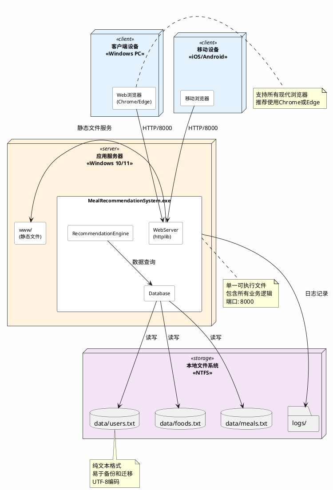

# 第5章 部署

## 5.1 部署概述

### 1. 编写目的

本章节的编写目的是为智能配餐推荐系统的部署提供完整、详细的指导文档，确保系统能够在目标环境中正确、高效地部署和运行。具体目的包括:

- **指导部署实施**：为系统管理员和运维人员提供清晰的部署流程和操作步骤
- **确保部署质量**：通过标准化的部署流程，减少人为错误，提高部署成功率
- **降低部署风险**：明确部署前的准备工作、注意事项和回退方案
- **建立部署标准**：为后续的系统升级、迁移提供参考标准
- **提供故障排查指南**：当部署过程出现问题时，能够快速定位和解决

### 2. 预期读者

本章节的预期读者包括:

| 读者角色 | 阅读目的 | 关注重点 |
|---------|---------|---------|
| **系统管理员** | 负责系统的安装和配置 | 部署流程、配置参数、环境设置 |
| **运维人员** | 负责系统的日常维护和监控 | 部署验证、监控配置、故障处理 |
| **开发人员** | 了解系统的部署架构 | 系统架构、依赖关系、接口配置 |
| **项目经理** | 评估部署计划和风险 | 部署时间、资源需求、风险控制 |
| **测试人员** | 验证系统部署的正确性 | 测试计划、验证步骤、功能检查 |
| **技术支持人员** | 提供部署技术支持 | 常见问题、解决方案、配置说明 |

---

## 5.2 系统环境配置

### 1. 硬件要求

智能配餐推荐系统作为一个轻量级的本地Web应用，对硬件要求相对较低，但为了保证系统的流畅运行和良好的用户体验，建议按照以下配置要求部署:

#### 1.1 最低配置（基本运行）

```
组件类别          规格要求                说明
━━━━━━━━━━━━━━━━━━━━━━━━━━━━━━━━━━━━━━━━━━━━━━━━━━
处理器(CPU)      双核 2.0 GHz            支持x64架构
                Intel Core i3 或 AMD Ryzen 3
                
内存(RAM)        4 GB DDR3/DDR4          最低运行内存
                实际可用 > 2 GB
                
存储空间         1 GB 可用空间           包含系统和数据
                建议使用SSD
                
显示器           1280×720 分辨率         支持现代浏览器
                
网络适配器       10/100 Mbps以太网卡     本地网络访问
                或Wi-Fi适配器
```

**最低配置适用场景**：
- 个人学习和测试
- 单用户使用
- 数据量较小（< 100个用户）

#### 1.2 推荐配置（标准运行）

```
组件类别          规格要求                说明
━━━━━━━━━━━━━━━━━━━━━━━━━━━━━━━━━━━━━━━━━━━━━━━━━━
处理器(CPU)      四核 3.0 GHz            推荐配置
                Intel Core i5 或 AMD Ryzen 5
                支持超线程技术
                
内存(RAM)        8 GB DDR4               推荐运行内存
                实际可用 > 4 GB
                
存储空间         10 GB 可用空间          包含系统、数据和日志
                SSD固态硬盘
                读写速度 > 500 MB/s
                
显示器           1920×1080 分辨率        最佳显示效果
                
网络适配器       1000 Mbps千兆以太网卡   快速网络访问
                支持Wi-Fi 5 (802.11ac)
                
其他外设         鼠标、键盘              标准输入设备
```

**推荐配置适用场景**：
- 多用户并发使用（5-10用户）
- 生产环境部署
- 数据量中等（100-500个用户）
- 需要较好的响应性能

#### 1.3 高性能配置（企业级部署）

```
组件类别          规格要求                说明
━━━━━━━━━━━━━━━━━━━━━━━━━━━━━━━━━━━━━━━━━━━━━━━━━━
处理器(CPU)      八核 3.5 GHz+           高性能配置
                Intel Core i7/i9 或 AMD Ryzen 7/9
                支持超线程、Turbo Boost
                
内存(RAM)        16 GB+ DDR4             高性能运行
                频率 ≥ 3200 MHz
                ECC内存（可选）
                
存储空间         50 GB+ 可用空间         充足的存储空间
                NVMe SSD固态硬盘
                读写速度 > 2000 MB/s
                RAID 1 阵列（可选）
                
显示器           2560×1440 或 4K分辨率   高清显示
                
网络适配器       1000 Mbps或更高         企业级网卡
                双网卡冗余（可选）
                
电源             UPS不间断电源           保证供电稳定
                容量 ≥ 1000 VA
                
散热系统         液冷或高效风冷          确保散热良好
```

**高性能配置适用场景**：
- 大规模并发使用（> 10用户）
- 企业级生产环境
- 数据量较大（> 500个用户）
- 需要7×24小时持续运行
- 对系统稳定性和响应速度要求高

#### 1.4 硬件配置对比表

| 指标 | 最低配置 | 推荐配置 | 高性能配置 |
|-----|---------|---------|-----------|
| **CPU核心数** | 2核 | 4核 | 8核+ |
| **CPU频率** | 2.0 GHz | 3.0 GHz | 3.5 GHz+ |
| **内存容量** | 4 GB | 8 GB | 16 GB+ |
| **存储类型** | HDD/SSD | SSD | NVMe SSD |
| **存储容量** | 1 GB | 10 GB | 50 GB+ |
| **网络带宽** | 100 Mbps | 1 Gbps | 1 Gbps+ |
| **并发用户** | 1-2 | 5-10 | 10+ |
| **响应时间** | < 3秒 | < 1秒 | < 500ms |
| **适用场景** | 学习测试 | 标准生产 | 企业级 |
| **预算范围** | 低 | 中 | 高 |

### 2. 软件要求

#### 2.1 操作系统要求

```
操作系统          版本要求              说明
━━━━━━━━━━━━━━━━━━━━━━━━━━━━━━━━━━━━━━━━━━━━━━━━━━━━━━
Windows 10       版本 1909 或更高       专业版/企业版/教育版
                64位操作系统           支持x64架构
                已安装最新更新

Windows 11       所有版本              专业版/企业版/教育版
                64位操作系统           支持x64架构
                已安装最新更新

Windows Server   2016/2019/2022        服务器版本（可选）
                64位操作系统           企业级部署
```

**操作系统选择建议**：
- **Windows 10**：最广泛使用，兼容性最好，推荐用于开发和测试
- **Windows 11**：最新系统，性能优化更好，适合新设备
- **Windows Server**：企业级部署，稳定性和安全性更高

**操作系统配置要求**：
- 已启用Windows Defender或安装第三方杀毒软件
- 已配置Windows防火墙规则
- 系统时间和时区设置正确
- 已禁用不必要的服务和启动项

#### 2.2 开发和编译工具

```
工具名称                版本要求          用途
━━━━━━━━━━━━━━━━━━━━━━━━━━━━━━━━━━━━━━━━━━━━━━━━━━━━
Visual Studio 2022     Community/        C++编译和构建
                      Professional/      推荐使用最新版本
                      Enterprise         
                      版本 17.0+

Visual Studio 2019     版本 16.0+        可选的替代方案
                      (兼容)            需要C++17支持

CMake                  3.10 或更高       跨平台构建工具
                      (可选)            用于非VS构建

Git                    2.30+             版本控制工具
                      (推荐)            代码管理
```

**Visual Studio工作负载要求**：

安装Visual Studio时需要选择以下工作负载:
```
必选工作负载：
  ✓ 使用C++的桌面开发
    ├─ MSVC v143 - VS 2022 C++ x64/x86生成工具
    ├─ Windows 10 SDK (最新版本)
    ├─ C++ CMake工具 (可选)
    └─ 针对最新版本的C++ ATL

推荐工作负载：
  ✓ .NET桌面开发 (可选)
  ✓ Git版本控制工具
```

**Visual Studio安装步骤**：
1. 访问 https://visualstudio.microsoft.com/
2. 下载Visual Studio 2022 Community版（免费）
3. 运行安装程序
4. 选择"使用C++的桌面开发"工作负载
5. 确保选中C++17标准支持
6. 点击"安装"，等待完成

#### 2.3 运行时依赖

```
依赖组件              版本要求          说明
━━━━━━━━━━━━━━━━━━━━━━━━━━━━━━━━━━━━━━━━━━━━━━━━━━━━
Visual C++ 可再发行   2015-2022版本     运行时库
软件包                x64架构           系统必须安装

Windows SDK           10.0.19041.0+     Windows开发工具包
                     (推荐最新版)       编译时需要

.NET Framework        4.7.2 或更高      系统框架
                     (通常已预装)       部分功能依赖
```

**Visual C++ 可再发行软件包安装**：
```
下载地址: https://aka.ms/vs/17/release/vc_redist.x64.exe

安装命令:
  vc_redist.x64.exe /install /quiet /norestart

验证安装:
  在"控制面板 → 程序和功能"中查看
  应显示"Microsoft Visual C++ 2015-2022 Redistributable (x64)"
```

#### 2.4 Web浏览器要求

系统的前端界面需要现代化的Web浏览器支持:

```
浏览器              推荐版本          兼容性
━━━━━━━━━━━━━━━━━━━━━━━━━━━━━━━━━━━━━━━━━━━━━━━━━━
Google Chrome      100+              ★★★★★ 完全支持
                  (推荐)            最佳性能

Microsoft Edge     100+              ★★★★★ 完全支持
                  (Chromium版)      推荐使用

Mozilla Firefox    100+              ★★★★☆ 良好支持
                  
Safari             14+               ★★★☆☆ 基本支持
                  (Mac)             部分功能

Internet Explorer  不支持            ✗ 不兼容
                  (已弃用)
```

**浏览器功能要求**：
- 支持HTML5和CSS3
- 支持JavaScript ES6+
- 支持Fetch API
- 启用JavaScript
- 启用Cookies
- 推荐启用浏览器的开发者工具（便于调试）

#### 2.5 第三方库和依赖

系统使用的第三方库（已包含在项目中，无需单独安装）：

```
库名称          版本        类型          说明
━━━━━━━━━━━━━━━━━━━━━━━━━━━━━━━━━━━━━━━━━━━━━━━━━━
httplib        0.11+       单头文件      HTTP服务器库
                          Header-only    include/third_party/httplib.h

Windows        WS2_32      系统库        网络通信
Sockets 2                  链接库        自动链接
```

#### 2.6 可选软件

以下软件虽非必须，但建议安装以提升开发和维护效率：

```
软件名称              用途                    推荐版本
━━━━━━━━━━━━━━━━━━━━━━━━━━━━━━━━━━━━━━━━━━━━━━━━━━━━━
VS Code             代码编辑器               1.80+
                   查看和编辑配置文件

Notepad++           文本编辑器               8.0+
                   编辑数据文件

Postman             API测试工具              10.0+
                   测试REST接口

Process Explorer    进程监控工具             16.0+
                   系统监控和调试

7-Zip               压缩解压工具             21.0+
                   文件管理

Git Bash            命令行工具               2.40+
                   执行脚本命令
```

#### 2.7 软件环境检查脚本

使用以下PowerShell脚本检查软件环境是否满足要求：

```powershell
# 环境检查脚本: check_environment.ps1

Write-Host "========================================" -ForegroundColor Cyan
Write-Host "智能配餐推荐系统 - 环境检查工具" -ForegroundColor Cyan
Write-Host "========================================" -ForegroundColor Cyan
Write-Host ""

# 检查操作系统
Write-Host "[1/6] 检查操作系统..." -ForegroundColor Yellow
$os = Get-WmiObject Win32_OperatingSystem
Write-Host "  操作系统: $($os.Caption)"
Write-Host "  版本: $($os.Version)"
Write-Host "  架构: $($os.OSArchitecture)"
if ($os.OSArchitecture -eq "64-bit") {
    Write-Host "  ✓ 64位系统" -ForegroundColor Green
} else {
    Write-Host "  ✗ 需要64位系统" -ForegroundColor Red
}

# 检查Visual Studio
Write-Host ""
Write-Host "[2/6] 检查Visual Studio..." -ForegroundColor Yellow
$vsPath = "C:\Program Files\Microsoft Visual Studio\2022"
if (Test-Path $vsPath) {
    Write-Host "  ✓ Visual Studio 2022已安装" -ForegroundColor Green
} else {
    Write-Host "  ✗ 未找到Visual Studio 2022" -ForegroundColor Red
}

# 检查Visual C++运行库
Write-Host ""
Write-Host "[3/6] 检查Visual C++运行库..." -ForegroundColor Yellow
$vcRedist = Get-ItemProperty "HKLM:\SOFTWARE\Microsoft\VisualStudio\14.0\VC\Runtimes\x64" -ErrorAction SilentlyContinue
if ($vcRedist) {
    Write-Host "  ✓ Visual C++ Redistributable已安装" -ForegroundColor Green
    Write-Host "  版本: $($vcRedist.Version)"
} else {
    Write-Host "  ✗ 需要安装Visual C++ Redistributable" -ForegroundColor Red
}

# 检查硬件配置
Write-Host ""
Write-Host "[4/6] 检查硬件配置..." -ForegroundColor Yellow
$cpu = Get-WmiObject Win32_Processor
$ram = [math]::Round((Get-WmiObject Win32_ComputerSystem).TotalPhysicalMemory / 1GB, 2)
Write-Host "  CPU: $($cpu.Name)"
Write-Host "  核心数: $($cpu.NumberOfCores)"
Write-Host "  内存: $ram GB"
if ($ram -ge 8) {
    Write-Host "  ✓ 内存满足推荐配置" -ForegroundColor Green
} elseif ($ram -ge 4) {
    Write-Host "  ⚠ 内存满足最低配置" -ForegroundColor Yellow
} else {
    Write-Host "  ✗ 内存不足" -ForegroundColor Red
}

# 检查磁盘空间
Write-Host ""
Write-Host "[5/6] 检查磁盘空间..." -ForegroundColor Yellow
$disk = Get-WmiObject Win32_LogicalDisk -Filter "DeviceID='C:'"
$freeGB = [math]::Round($disk.FreeSpace / 1GB, 2)
Write-Host "  C盘可用空间: $freeGB GB"
if ($freeGB -ge 10) {
    Write-Host "  ✓ 磁盘空间充足" -ForegroundColor Green
} elseif ($freeGB -ge 1) {
    Write-Host "  ⚠ 磁盘空间紧张" -ForegroundColor Yellow
} else {
    Write-Host "  ✗ 磁盘空间不足" -ForegroundColor Red
}

# 检查网络连接
Write-Host ""
Write-Host "[6/6] 检查网络连接..." -ForegroundColor Yellow
$ping = Test-Connection -ComputerName www.baidu.com -Count 1 -Quiet
if ($ping) {
    Write-Host "  ✓ 网络连接正常" -ForegroundColor Green
} else {
    Write-Host "  ⚠ 网络连接异常" -ForegroundColor Yellow
}

Write-Host ""
Write-Host "========================================" -ForegroundColor Cyan
Write-Host "环境检查完成！" -ForegroundColor Cyan
Write-Host "========================================" -ForegroundColor Cyan
```

**使用方法**：
```powershell
# 以管理员身份运行PowerShell
# 执行策略设置（首次运行）
Set-ExecutionPolicy -ExecutionPolicy RemoteSigned -Scope CurrentUser

# 运行检查脚本
.\check_environment.ps1
```

---

## 5.3 部署步骤

### 1. 准备工作

#### 1.1 获取部署包

**方法一：从GitHub克隆源代码**（推荐用于开发）

```bash
# 1. 安装Git（如果尚未安装）
# 下载地址: https://git-scm.com/download/win

# 2. 打开Git Bash或命令提示符
# 3. 克隆仓库
git clone https://github.com/Quanda666/SmartMealSystem.git

# 4. 进入项目目录
cd SmartMealSystem

# 5. 检查项目结构
dir
```

**方法二：下载ZIP压缩包**（推荐用于快速部署）

```
步骤：
1. 访问: https://github.com/Quanda666/SmartMealSystem
2. 点击绿色的"Code"按钮
3. 选择"Download ZIP"
4. 下载完成后解压到目标目录
5. 建议解压路径: C:\MealRecommendationSystem
```

**方法三：使用发布版本**（推荐用于生产环境）

```
步骤：
1. 访问项目的Releases页面
2. 下载最新的发布版本
3. 解压到目标目录
4. 包含预编译的可执行文件
```

#### 1.2 创建部署目录结构

```batch
@echo off
REM 创建部署目录结构脚本: setup_directories.bat

echo 创建部署目录结构...

REM 设置部署根目录
set DEPLOY_ROOT=C:\MealRecommendationSystem

REM 创建主目录
if not exist "%DEPLOY_ROOT%" mkdir "%DEPLOY_ROOT%"

REM 创建子目录
mkdir "%DEPLOY_ROOT%\bin"
mkdir "%DEPLOY_ROOT%\data"
mkdir "%DEPLOY_ROOT%\logs"
mkdir "%DEPLOY_ROOT%\www"
mkdir "%DEPLOY_ROOT%\backup"
mkdir "%DEPLOY_ROOT%\config"

REM 设置目录权限
icacls "%DEPLOY_ROOT%" /grant Users:(OI)(CI)F /T

echo 目录结构创建完成！
echo 部署根目录: %DEPLOY_ROOT%
pause
```

**创建的目录结构**：
```
C:\MealRecommendationSystem\
├── bin\              # 可执行文件和DLL
├── data\             # 数据文件
│   ├── users.txt     # 用户数据
│   ├── foods.txt     # 食物数据
│   └── meals.txt     # 餐单数据
├── logs\             # 日志文件
├── www\              # Web前端文件
│   ├── index.html
│   ├── style.css
│   └── app.js
├── backup\           # 数据备份
└── config\           # 配置文件（可选）
```

#### 1.3 安装必要的软件工具

**安装清单**：

```powershell
# PowerShell脚本: install_dependencies.ps1

Write-Host "开始安装依赖组件..." -ForegroundColor Cyan

# 1. 检查并安装Visual C++ Redistributable
Write-Host "检查Visual C++ Redistributable..." -ForegroundColor Yellow
$vcRedist = "https://aka.ms/vs/17/release/vc_redist.x64.exe"
$vcInstaller = "$env:TEMP\vc_redist.x64.exe"

if (!(Get-ItemProperty "HKLM:\SOFTWARE\Microsoft\VisualStudio\14.0\VC\Runtimes\x64" -ErrorAction SilentlyContinue)) {
    Write-Host "下载Visual C++ Redistributable..." -ForegroundColor Yellow
    Invoke-WebRequest -Uri $vcRedist -OutFile $vcInstaller
    Write-Host "安装Visual C++ Redistributable..." -ForegroundColor Yellow
    Start-Process -FilePath $vcInstaller -ArgumentList "/install", "/quiet", "/norestart" -Wait
    Remove-Item $vcInstaller
    Write-Host "✓ Visual C++ Redistributable安装完成" -ForegroundColor Green
} else {
    Write-Host "✓ Visual C++ Redistributable已安装" -ForegroundColor Green
}

# 2. 配置Windows防火墙规则
Write-Host ""
Write-Host "配置Windows防火墙..." -ForegroundColor Yellow
$ruleName = "MealRecommendationSystem"
$existingRule = Get-NetFirewallRule -DisplayName $ruleName -ErrorAction SilentlyContinue
if (!$existingRule) {
    New-NetFirewallRule -DisplayName $ruleName `
                        -Direction Inbound `
                        -Action Allow `
                        -Protocol TCP `
                        -LocalPort 8000 `
                        -Profile Domain,Private,Public
    Write-Host "✓ 防火墙规则创建成功" -ForegroundColor Green
} else {
    Write-Host "✓ 防火墙规则已存在" -ForegroundColor Green
}

Write-Host ""
Write-Host "依赖组件安装完成！" -ForegroundColor Cyan
```

**手动配置防火墙规则**（如果脚本失败）：

```
步骤：
1. 打开"Windows Defender 防火墙"
2. 点击"高级设置"
3. 选择"入站规则"
4. 点击右侧的"新建规则"
5. 规则类型选择"端口"
6. 协议选择"TCP"，端口输入"8000"
7. 操作选择"允许连接"
8. 配置文件全选
9. 名称输入"MealRecommendationSystem"
10. 点击"完成"
```

#### 1.4 环境变量配置（可选）

如果希望从任何位置运行系统，可以配置环境变量：

```batch
REM 添加到系统PATH
setx PATH "%PATH%;C:\MealRecommendationSystem\bin" /M

REM 创建快捷方式到桌面
powershell "$ws = New-Object -ComObject WScript.Shell; $s = $ws.CreateShortcut('%USERPROFILE%\Desktop\智能配餐系统.lnk'); $s.TargetPath = 'C:\MealRecommendationSystem\bin\MealRecommendationSystem.exe'; $s.Save()"
```

### 2. 部署流程

#### 2.1 开发环境部署（使用Visual Studio）

**步骤一：打开项目**

```
1. 启动Visual Studio 2022
2. 选择"打开项目或解决方案"
3. 浏览到项目目录
4. 选择"MealRecommendationSystem.sln"
5. 点击"打开"
```

**步骤二：配置项目**

```
1. 在"解决方案资源管理器"中右键点击项目
2. 选择"属性"
3. 配置属性:
   
   常规:
   - C++语言标准: ISO C++17 Standard (/std:c++17)
   - 平台工具集: Visual Studio 2022 (v143)
   
   C/C++ → 常规:
   - 附加包含目录: $(ProjectDir)include;$(ProjectDir)include\third_party
   
   C/C++ → 预处理器:
   - 预处理器定义: _WIN32_WINNT=0x0A00;_CRT_SECURE_NO_WARNINGS
   
   链接器 → 输入:
   - 附加依赖项: ws2_32.lib
   
4. 点击"应用"和"确定"
```

**步骤三：选择编译配置**

```
配置选项：

Debug配置（开发和调试）:
- 用途: 开发过程中的调试
- 优化: 禁用优化（/Od）
- 调试信息: 完整（/Zi）
- 运行时库: 多线程调试DLL (/MDd)
- 文件大小: 较大
- 执行速度: 较慢
- 推荐场景: 开发、单元测试、问题排查

Release配置（生产部署）:
- 用途: 正式发布和生产环境
- 优化: 最大优化（/O2）
- 调试信息: 无或最小
- 运行时库: 多线程DLL (/MD)
- 文件大小: 较小
- 执行速度: 最快
- 推荐场景: 生产部署、性能测试

选择方法：
在Visual Studio顶部工具栏选择：
- 配置: Release（推荐）或 Debug
- 平台: x64（推荐）或 x86
```

**步骤四：编译项目**

```
方法一：使用菜单
1. 点击菜单"生成" → "生成解决方案"
2. 或按快捷键 Ctrl+Shift+B

方法二：使用工具栏
1. 点击工具栏的"生成"按钮
2. 等待编译完成

编译输出位置：
- Debug配置: <项目目录>\x64\Debug\
- Release配置: <项目目录>\x64\Release\

编译成功标志：
========== 生成: 成功 1 个，失败 0 个，最新 0 个，跳过 0 个 ==========
```

**步骤五：运行和测试**

```
方法一：从Visual Studio运行（带调试）
1. 按F5或点击"本地Windows调试器"
2. 程序启动并自动打开浏览器
3. 控制台窗口显示服务器日志
4. 可以设置断点进行调试

方法二：独立运行（不带调试）
1. 按Ctrl+F5或选择"调试" → "开始执行(不调试)"
2. 程序启动但不附加调试器
3. 性能更接近生产环境

验证运行成功：
✓ 控制台显示: "Server is running on http://localhost:8000"
✓ 浏览器自动打开: http://localhost:8000
✓ 页面正确显示登录/注册界面
✓ 没有错误消息
```

#### 2.2 生产环境部署（独立部署）

**步骤一：编译Release版本**

```batch
REM 使用MSBuild命令行编译
REM 文件: build_release.bat

@echo off
echo ========================================
echo 编译智能配餐推荐系统 - Release版本
echo ========================================
echo.

REM 设置MSBuild路径
set MSBUILD="C:\Program Files\Microsoft Visual Studio\2022\Community\MSBuild\Current\Bin\MSBuild.exe"

REM 检查MSBuild是否存在
if not exist %MSBUILD% (
    echo 错误: 未找到MSBuild.exe
    echo 请确认Visual Studio 2022已正确安装
    pause
    exit /b 1
)

REM 清理旧的编译输出
echo [1/3] 清理旧的编译输出...
%MSBUILD% MealRecommendationSystem.sln /t:Clean /p:Configuration=Release /p:Platform=x64
echo.

REM 编译项目
echo [2/3] 编译项目...
%MSBUILD% MealRecommendationSystem.sln /t:Build /p:Configuration=Release /p:Platform=x64 /m
if %ERRORLEVEL% NEQ 0 (
    echo 错误: 编译失败
    pause
    exit /b 1
)
echo.

REM 显示编译结果
echo [3/3] 编译完成！
echo 输出目录: x64\Release\
echo.

REM 列出生成的文件
dir x64\Release\*.exe
echo.

echo ========================================
echo 编译成功完成！
echo ========================================
pause
```

**步骤二：复制部署文件**

```batch
REM 部署脚本: deploy.bat

@echo off
setlocal enabledelayedexpansion

echo ========================================
echo 智能配餐推荐系统 - 部署脚本
echo ========================================
echo.

REM 设置源目录和目标目录
set SOURCE_DIR=%~dp0
set TARGET_DIR=C:\MealRecommendationSystem
set RELEASE_DIR=%SOURCE_DIR%x64\Release

REM 检查Release目录是否存在
if not exist "%RELEASE_DIR%\MealRecommendationSystem.exe" (
    echo 错误: 未找到编译后的可执行文件
    echo 请先运行 build_release.bat 编译项目
    pause
    exit /b 1
)

echo [1/6] 创建部署目录...
if not exist "%TARGET_DIR%" mkdir "%TARGET_DIR%"
if not exist "%TARGET_DIR%\bin" mkdir "%TARGET_DIR%\bin"
if not exist "%TARGET_DIR%\data" mkdir "%TARGET_DIR%\data"
if not exist "%TARGET_DIR%\www" mkdir "%TARGET_DIR%\www"
if not exist "%TARGET_DIR%\logs" mkdir "%TARGET_DIR%\logs"
if not exist "%TARGET_DIR%\backup" mkdir "%TARGET_DIR%\backup"
echo 完成
echo.

echo [2/6] 停止现有服务（如果运行中）...
taskkill /f /im MealRecommendationSystem.exe 2>nul
timeout /t 2 /nobreak >nul
echo 完成
echo.

echo [3/6] 备份现有数据...
if exist "%TARGET_DIR%\data" (
    set BACKUP_DATE=%date:~0,4%%date:~5,2%%date:~8,2%_%time:~0,2%%time:~3,2%%time:~6,2%
    set BACKUP_DATE=!BACKUP_DATE: =0!
    xcopy /E /I /Y "%TARGET_DIR%\data" "%TARGET_DIR%\backup\data_!BACKUP_DATE!"
    echo 备份到: backup\data_!BACKUP_DATE!
) else (
    echo 无现有数据需要备份
)
echo.

echo [4/6] 复制可执行文件...
copy /Y "%RELEASE_DIR%\MealRecommendationSystem.exe" "%TARGET_DIR%\bin\"
if %ERRORLEVEL% NEQ 0 (
    echo 错误: 文件复制失败
    pause
    exit /b 1
)
echo 完成
echo.

echo [5/6] 复制Web前端文件...
xcopy /E /I /Y "%SOURCE_DIR%www\*" "%TARGET_DIR%\www\"
echo 完成
echo.

echo [6/6] 初始化数据文件...
if not exist "%TARGET_DIR%\data\users.txt" (
    xcopy /E /I /Y "%SOURCE_DIR%data\*" "%TARGET_DIR%\data\"
    echo 数据文件已初始化
) else (
    echo 保留现有数据文件
)
echo.

echo ========================================
echo 部署成功完成！
echo ========================================
echo.
echo 部署位置: %TARGET_DIR%
echo 可执行文件: %TARGET_DIR%\bin\MealRecommendationSystem.exe
echo.
echo 按任意键启动服务...
pause >nul

REM 启动服务
cd /d "%TARGET_DIR%\bin"
start MealRecommendationSystem.exe

echo 服务已启动！
echo 浏览器将自动打开 http://localhost:8000
echo.
pause
```

**步骤三：配置自动启动（可选）**

如果希望系统开机自动启动，可以创建Windows服务或计划任务：

**方法一：使用任务计划程序**

```batch
REM 创建自动启动任务: create_scheduled_task.bat

@echo off
echo 创建开机自动启动任务...

schtasks /create /tn "智能配餐推荐系统" ^
    /tr "C:\MealRecommendationSystem\bin\MealRecommendationSystem.exe" ^
    /sc onlogon ^
    /rl highest ^
    /f

if %ERRORLEVEL% EQU 0 (
    echo ✓ 自动启动任务创建成功
    echo 系统将在用户登录时自动启动
) else (
    echo ✗ 任务创建失败，请以管理员身份运行
)

pause
```

**方法二：添加到启动文件夹**

```batch
REM 添加到启动文件夹: add_to_startup.bat

@echo off
set STARTUP_FOLDER=%APPDATA%\Microsoft\Windows\Start Menu\Programs\Startup
set SHORTCUT_NAME=智能配餐推荐系统.lnk
set TARGET_PATH=C:\MealRecommendationSystem\bin\MealRecommendationSystem.exe

echo 创建启动快捷方式...

powershell -Command "$ws = New-Object -ComObject WScript.Shell; $s = $ws.CreateShortcut('%STARTUP_FOLDER%\%SHORTCUT_NAME%'); $s.TargetPath = '%TARGET_PATH%'; $s.WorkingDirectory = 'C:\MealRecommendationSystem\bin'; $s.Save()"

echo ✓ 快捷方式已添加到启动文件夹
echo 位置: %STARTUP_FOLDER%
pause
```

#### 2.3 使用CMake构建（跨平台）

对于需要跨平台或命令行构建的场景：

```bash
# CMake构建脚本（PowerShell或Bash）

# 1. 创建构建目录
mkdir build
cd build

# 2. 生成构建文件
cmake .. -G "Visual Studio 17 2022" -A x64

# 3. 编译项目
cmake --build . --config Release

# 4. 安装到目标目录
cmake --install . --prefix C:/MealRecommendationSystem
```

### 3. 配置说明

#### 3.1 服务器配置

系统的服务器配置主要在源代码中设置。如需修改配置，需要编辑源文件并重新编译。

**主要配置项（位于 src/main.cpp）**：

```cpp
// src/main.cpp

#include "WebServer.h"
#include <iostream>

int main() {
    try {
        // 配置项
        const int PORT = 8000;                    // 服务器端口
        const std::string WWW_DIR = "www";        // Web文件目录
        const std::string DATA_DIR = "data";      // 数据文件目录
        
        // 创建并启动服务器
        WebServer server(PORT, WWW_DIR);
        
        // 初始化数据库
        server.getDatabase().initialize(DATA_DIR);
        
        // 启动服务器
        std::cout << "智能配餐推荐系统正在启动..." << std::endl;
        std::cout << "服务器地址: http://localhost:" << PORT << std::endl;
        
        // 自动打开浏览器
        server.openBrowser();
        
        // 开始监听
        server.start();
        
    } catch (const std::exception& e) {
        std::cerr << "错误: " << e.what() << std::endl;
        return 1;
    }
    
    return 0;
}
```

**常见配置修改**：

1. **修改端口号**：
```cpp
// 将 PORT 改为其他值
const int PORT = 9000;  // 改为9000端口
```

2. **修改数据目录**：
```cpp
// 修改数据文件存储位置
const std::string DATA_DIR = "C:/MealData";  // 绝对路径
```

3. **禁用自动打开浏览器**：
```cpp
// 注释掉这一行
// server.openBrowser();
```

#### 3.2 数据库配置

数据文件存储在 `data/` 目录下，使用纯文本格式。

**数据文件说明**：

**users.txt - 用户数据**：
```
格式: username|password|age|gender|weight|height|activityLevel|targetCalories|targetProtein|targetCarbs|targetFat

示例:
admin|admin123|25|male|70.0|175.0|moderate|2500.0|187.5|250.0|83.3
user1|pass123|30|female|60.0|165.0|light|2000.0|150.0|200.0|66.7
```

**foods.txt - 食物数据**：
```
格式: id|name|category|calories|protein|carbs|fat|tags

示例:
1|鸡蛋|蛋类|147|12.6|1.1|9.9|高蛋白,低碳水
2|燕麦|谷物|389|16.9|66.3|6.9|高纤维,健康
3|鸡胸肉|肉类|165|31.0|0.0|3.6|高蛋白,低脂
```

**meals.txt - 餐单数据**：
```
格式: id|userId|date|mealType|foodIds|totalCalories|totalProtein|totalCarbs|totalFat|createTime

示例:
1|admin|2024-01-15|breakfast|1,2,5|580|28.5|68.4|18.7|2024-01-15 08:30:00
2|admin|2024-01-15|lunch|3,4,6,7|920|52.3|95.2|28.5|2024-01-15 12:45:00
```

**数据文件编辑注意事项**：
- 使用UTF-8编码保存
- 字段之间用竖线`|`分隔
- 每行一条记录
- 不要添加额外的空行或空格
- 备份后再修改

#### 3.3 前端配置

**API端点配置（www/app.js）**：

```javascript
// API基础URL
const API_BASE_URL = 'http://localhost:8000/api';

// API端点
const API_ENDPOINTS = {
    login: `${API_BASE_URL}/login`,
    register: `${API_BASE_URL}/register`,
    profile: `${API_BASE_URL}/user/profile`,
    foods: `${API_BASE_URL}/foods`,
    meals: {
        history: `${API_BASE_URL}/meals/history`,
        recommend: `${API_BASE_URL}/meals/recommend`,
        save: `${API_BASE_URL}/meals/save`,
        delete: (id) => `${API_BASE_URL}/meals/${id}`
    }
};
```

如果修改了端口号，需要相应修改 `API_BASE_URL`。

#### 3.4 部署配置总结表

| 配置项 | 默认值 | 位置 | 说明 |
|-------|--------|------|------|
| **服务器端口** | 8000 | src/main.cpp | HTTP服务监听端口 |
| **Web目录** | www | src/main.cpp | 前端文件目录 |
| **数据目录** | data | src/main.cpp | 数据文件目录 |
| **用户数据文件** | users.txt | data/ | 用户信息存储 |
| **食物数据文件** | foods.txt | data/ | 食物库数据 |
| **餐单数据文件** | meals.txt | data/ | 餐单历史记录 |
| **API基础URL** | localhost:8000 | www/app.js | 前端API地址 |
| **会话超时** | 3600秒 | WebServer.cpp | 用户会话有效期 |
| **最大连接数** | 默认 | httplib | HTTP服务器连接数 |

#### 3.5 部署图（UML）

下面是系统的部署图，展示了各个组件在物理节点上的部署关系：



**部署图说明**：

1. **客户端层**：
   - 支持桌面和移动设备
   - 通过标准HTTP协议访问
   - 无需安装客户端软件

2. **应用服务器层**：
   - 单一可执行文件，简化部署
   - 集成Web服务器、业务逻辑和数据访问
   - 提供静态文件服务和RESTful API

3. **存储层**：
   - 使用本地文件系统存储
   - 纯文本格式，易于管理
   - 支持文件级备份

**部署拓扑图（简化版）**：

```
┌─────────────────────────────────────────────────────────────┐
│                        客户端层                               │
│  ┌──────────────┐  ┌──────────────┐  ┌──────────────┐      │
│  │ Windows PC   │  │   Mac PC     │  │ Mobile Device│      │
│  │  (Browser)   │  │  (Browser)   │  │  (Browser)   │      │
│  └──────┬───────┘  └──────┬───────┘  └──────┬───────┘      │
└─────────┼──────────────────┼──────────────────┼─────────────┘
          │                  │                  │
          └──────────────────┼──────────────────┘
                            │ HTTP (Port 8000)
          ┌─────────────────┴──────────────────┐
          │                                    │
┌─────────▼────────────────────────────────────▼─────────────┐
│                    应用服务器层                              │
│  ┌──────────────────────────────────────────────────────┐  │
│  │   Windows 10/11 (x64)                               │  │
│  │                                                      │  │
│  │   ┌────────────────────────────────────────────┐   │  │
│  │   │  MealRecommendationSystem.exe              │   │  │
│  │   │  ┌──────────┐  ┌──────────┐  ┌──────────┐ │   │  │
│  │   │  │WebServer │  │  Engine  │  │ Database │ │   │  │
│  │   │  │(httplib) │←→│(Algorithm)│←→│ (Manager)│ │   │  │
│  │   │  └──────────┘  └──────────┘  └──────────┘ │   │  │
│  │   └────────────────────────────────────────────┘   │  │
│  │                                                      │  │
│  │   ┌────────────────────────────────────────────┐   │  │
│  │   │  www/ (静态文件)                            │   │  │
│  │   │  • index.html  • style.css  • app.js       │   │  │
│  │   └────────────────────────────────────────────┘   │  │
│  └──────────────────────────────────────────────────────┘  │
└──────────────────────────┬──────────────────────────────────┘
                          │
┌─────────────────────────▼──────────────────────────────────┐
│                      存储层                                  │
│  ┌──────────────────────────────────────────────────────┐  │
│  │   C:\MealRecommendationSystem\                      │  │
│  │                                                      │  │
│  │   data/                    logs/                    │  │
│  │   ├─ users.txt            ├─ server.log           │  │
│  │   ├─ foods.txt            └─ error.log            │  │
│  │   └─ meals.txt                                     │  │
│  │                                                      │  │
│  │   backup/                                            │  │
│  │   └─ data_YYYYMMDD/                                 │  │
│  └──────────────────────────────────────────────────────┘  │
└─────────────────────────────────────────────────────────────┘
```

**组件部署清单**：

| 组件 | 部署位置 | 说明 |
|-----|---------|------|
| **MealRecommendationSystem.exe** | C:\MealRecommendationSystem\bin\ | 主程序可执行文件 |
| **www/** | C:\MealRecommendationSystem\www\ | 前端静态文件 |
| **data/** | C:\MealRecommendationSystem\data\ | 数据文件 |
| **logs/** | C:\MealRecommendationSystem\logs\ | 日志文件（可选） |
| **backup/** | C:\MealRecommendationSystem\backup\ | 数据备份（可选） |

---

## 5.4 数据迁移与初始化

### 1. 数据迁移

#### 1.1 迁移场景

数据迁移主要应用于以下场景：

| 场景 | 说明 | 迁移内容 |
|-----|------|---------|
| **系统升级** | 从旧版本升级到新版本 | 用户数据、历史记录 |
| **服务器迁移** | 更换部署服务器 | 全部数据文件 |
| **数据备份恢复** | 从备份恢复数据 | 根据需要选择 |
| **开发到生产** | 从开发环境迁移到生产 | 初始数据、配置 |
| **数据整合** | 合并多个系统的数据 | 用户数据、食物库 |

#### 1.2 数据迁移步骤

**步骤一：备份现有数据**

```batch
REM 数据备份脚本: backup_data.bat

@echo off
setlocal enabledelayedexpansion

echo ========================================
echo 数据备份工具
echo ========================================
echo.

REM 设置源数据目录
set SOURCE_DIR=C:\MealRecommendationSystem\data

REM 生成备份目录名（带时间戳）
set BACKUP_DATE=%date:~0,4%%date:~5,2%%date:~8,2%_%time:~0,2%%time:~3,2%%time:~6,2%
set BACKUP_DATE=!BACKUP_DATE: =0!
set BACKUP_DIR=C:\MealRecommendationSystem\backup\data_!BACKUP_DATE!

echo [1/3] 检查源数据目录...
if not exist "%SOURCE_DIR%" (
    echo 错误: 源数据目录不存在: %SOURCE_DIR%
    pause
    exit /b 1
)
echo 完成
echo.

echo [2/3] 创建备份目录...
mkdir "%BACKUP_DIR%"
echo 备份目录: %BACKUP_DIR%
echo.

echo [3/3] 复制数据文件...
xcopy /E /I /Y "%SOURCE_DIR%\*" "%BACKUP_DIR%\"
if %ERRORLEVEL% EQU 0 (
    echo ✓ 数据备份成功
    echo.
    echo 备份位置: %BACKUP_DIR%
    echo 备份文件:
    dir /B "%BACKUP_DIR%"
) else (
    echo ✗ 数据备份失败
)

echo.
echo ========================================
pause
```

**步骤二：导出数据（可选格式转换）**

如果需要将数据转换为其他格式（如JSON、CSV），可以使用以下脚本：

```python
# 数据导出脚本: export_data.py
# 需要Python 3.6+

import os
import json
import csv
from datetime import datetime

DATA_DIR = r"C:\MealRecommendationSystem\data"
EXPORT_DIR = r"C:\MealRecommendationSystem\export"

def export_users_to_json():
    """导出用户数据为JSON格式"""
    print("导出用户数据...")
    users = []
    
    with open(os.path.join(DATA_DIR, "users.txt"), "r", encoding="utf-8") as f:
        for line in f:
            if line.strip():
                parts = line.strip().split("|")
                user = {
                    "username": parts[0],
                    "password": parts[1],
                    "age": int(parts[2]),
                    "gender": parts[3],
                    "weight": float(parts[4]),
                    "height": float(parts[5]),
                    "activityLevel": parts[6],
                    "targetCalories": float(parts[7]),
                    "targetProtein": float(parts[8]),
                    "targetCarbs": float(parts[9]),
                    "targetFat": float(parts[10])
                }
                users.append(user)
    
    os.makedirs(EXPORT_DIR, exist_ok=True)
    with open(os.path.join(EXPORT_DIR, "users.json"), "w", encoding="utf-8") as f:
        json.dump(users, f, ensure_ascii=False, indent=2)
    
    print(f"✓ 导出 {len(users)} 个用户到 users.json")

def export_foods_to_csv():
    """导出食物数据为CSV格式"""
    print("导出食物数据...")
    
    os.makedirs(EXPORT_DIR, exist_ok=True)
    with open(os.path.join(DATA_DIR, "foods.txt"), "r", encoding="utf-8") as fin:
        with open(os.path.join(EXPORT_DIR, "foods.csv"), "w", newline="", encoding="utf-8-sig") as fout:
            writer = csv.writer(fout)
            writer.writerow(["ID", "名称", "类别", "热量", "蛋白质", "碳水", "脂肪", "标签"])
            
            count = 0
            for line in fin:
                if line.strip():
                    parts = line.strip().split("|")
                    writer.writerow(parts)
                    count += 1
    
    print(f"✓ 导出 {count} 个食物到 foods.csv")

def export_meals_to_json():
    """导出餐单数据为JSON格式"""
    print("导出餐单数据...")
    meals = []
    
    with open(os.path.join(DATA_DIR, "meals.txt"), "r", encoding="utf-8") as f:
        for line in f:
            if line.strip():
                parts = line.strip().split("|")
                meal = {
                    "id": parts[0],
                    "userId": parts[1],
                    "date": parts[2],
                    "mealType": parts[3],
                    "foodIds": parts[4].split(","),
                    "totalCalories": float(parts[5]),
                    "totalProtein": float(parts[6]),
                    "totalCarbs": float(parts[7]),
                    "totalFat": float(parts[8]),
                    "createTime": parts[9] if len(parts) > 9 else ""
                }
                meals.append(meal)
    
    os.makedirs(EXPORT_DIR, exist_ok=True)
    with open(os.path.join(EXPORT_DIR, "meals.json"), "w", encoding="utf-8") as f:
        json.dump(meals, f, ensure_ascii=False, indent=2)
    
    print(f"✓ 导出 {len(meals)} 个餐单到 meals.json")

if __name__ == "__main__":
    print("========================================")
    print("数据导出工具")
    print("========================================")
    print()
    
    try:
        export_users_to_json()
        export_foods_to_csv()
        export_meals_to_json()
        
        print()
        print("========================================")
        print("✓ 数据导出完成！")
        print(f"导出位置: {EXPORT_DIR}")
        print("========================================")
    except Exception as e:
        print(f"✗ 导出失败: {e}")
```

**步骤三：迁移数据到新环境**

```batch
REM 数据迁移脚本: migrate_data.bat

@echo off
setlocal enabledelayedexpansion

echo ========================================
echo 数据迁移工具
echo ========================================
echo.

REM 设置源和目标路径
set /p SOURCE="请输入源数据路径 (例如: D:\backup\data_20240115): "
set TARGET=C:\MealRecommendationSystem\data

echo.
echo 源路径: %SOURCE%
echo 目标路径: %TARGET%
echo.
set /p CONFIRM="确认迁移? (Y/N): "

if /i not "%CONFIRM%"=="Y" (
    echo 取消迁移
    pause
    exit /b 0
)

echo.
echo [1/4] 停止应用服务...
taskkill /f /im MealRecommendationSystem.exe 2>nul
timeout /t 2 /nobreak >nul
echo 完成
echo.

echo [2/4] 备份当前数据...
set BACKUP_DATE=%date:~0,4%%date:~5,2%%date:~8,2%_%time:~0,2%%time:~3,2%%time:~6,2%
set BACKUP_DATE=!BACKUP_DATE: =0!
xcopy /E /I /Y "%TARGET%" "C:\MealRecommendationSystem\backup\data_before_migrate_!BACKUP_DATE!"
echo 完成
echo.

echo [3/4] 迁移数据文件...
xcopy /E /I /Y "%SOURCE%\*" "%TARGET%\"
if %ERRORLEVEL% EQU 0 (
    echo ✓ 数据迁移成功
) else (
    echo ✗ 数据迁移失败
    echo 正在恢复备份...
    xcopy /E /I /Y "C:\MealRecommendationSystem\backup\data_before_migrate_!BACKUP_DATE!\*" "%TARGET%\"
    pause
    exit /b 1
)
echo.

echo [4/4] 验证数据完整性...
if exist "%TARGET%\users.txt" (
    echo ✓ users.txt 存在
) else (
    echo ✗ users.txt 缺失
)
if exist "%TARGET%\foods.txt" (
    echo ✓ foods.txt 存在
) else (
    echo ✗ foods.txt 缺失
)
if exist "%TARGET%\meals.txt" (
    echo ✓ meals.txt 存在
) else (
    echo ✗ meals.txt 缺失
)

echo.
echo ========================================
echo 数据迁移完成！
echo ========================================
echo.
echo 可以重新启动应用服务
pause
```

#### 1.3 数据迁移注意事项

```
⚠ 重要提示：

1. 数据兼容性：
   • 确保新旧版本的数据格式兼容
   • 检查字段数量和类型是否一致
   • 注意字符编码（统一使用UTF-8）

2. 服务停止：
   • 迁移前必须停止应用服务
   • 避免数据正在被写入时迁移
   • 等待所有用户退出

3. 备份策略：
   • 迁移前务必备份现有数据
   • 保留多个版本的备份
   • 测试备份的可恢复性

4. 数据验证：
   • 迁移后检查文件完整性
   • 验证数据条数是否正确
   • 抽查数据内容是否正确

5. 回退方案：
   • 准备回退步骤
   • 保留原始数据备份
   • 迁移失败时立即恢复

6. 权限检查：
   • 确保目标目录有写权限
   • 检查文件不是只读状态
   • 以管理员身份运行脚本
```

### 2. 系统初始化

#### 2.1 首次部署初始化

系统首次部署时会自动初始化示例数据。如果需要手动初始化，可以使用以下步骤：

**步骤一：准备初始数据文件**

确保 `data/` 目录下存在以下文件：

```
data/
├── users.txt       # 初始用户（可以为空）
├── foods.txt       # 食物库（必须有数据）
└── meals.txt       # 餐单历史（可以为空）
```

**步骤二：食物库初始化**

食物库是系统的核心数据，建议包含丰富的食物信息：

```
# data/foods.txt 示例内容
# 格式: id|name|category|calories|protein|carbs|fat|tags

# 谷物类
1|燕麦片|谷物|389|16.9|66.3|6.9|高纤维,低GI,健康
2|糙米|谷物|370|7.7|77.2|2.9|全谷物,高纤维
3|全麦面包|谷物|247|13.0|41.0|4.0|全谷物,高纤维
4|玉米|谷物|112|3.4|25.1|1.5|粗粮,富含纤维

# 蛋白质类
10|鸡蛋|蛋类|147|12.6|1.1|9.9|高蛋白,营养丰富
11|鸡胸肉|肉类|165|31.0|0.0|3.6|高蛋白,低脂
12|三文鱼|鱼类|208|20.4|0.0|13.4|Omega-3,高蛋白
13|豆腐|豆制品|76|8.1|1.9|4.8|植物蛋白,低脂

# 蔬菜类
20|西兰花|蔬菜|34|2.8|7.0|0.4|高纤维,维生素C
21|胡萝卜|蔬菜|41|0.9|9.6|0.2|胡萝卜素,护眼
22|菠菜|蔬菜|23|2.9|3.6|0.4|铁,叶酸
23|番茄|蔬菜|18|0.9|3.9|0.2|番茄红素,抗氧化

# 水果类
30|苹果|水果|52|0.3|13.8|0.2|膳食纤维,维生素
31|香蕉|水果|89|1.1|22.8|0.3|钾,能量
32|蓝莓|水果|57|0.7|14.5|0.3|抗氧化,护眼
33|橙子|水果|47|0.9|11.8|0.1|维生素C,纤维

# 乳制品
40|牛奶|乳制品|61|3.2|4.8|3.3|钙,蛋白质
41|酸奶|乳制品|59|10.0|3.6|0.4|益生菌,蛋白质
42|奶酪|乳制品|402|25.0|1.3|33.0|高钙,高蛋白

# 坚果类
50|杏仁|坚果|579|21.2|21.6|49.9|健康脂肪,维E
51|核桃|坚果|654|15.2|13.7|65.2|Omega-3,护脑
52|花生|坚果|567|25.8|16.1|49.2|蛋白质,维E
```

**步骤三：创建管理员账户**

```
# data/users.txt 示例 - 管理员账户
# 格式: username|password|age|gender|weight|height|activityLevel|targetCalories|targetProtein|targetCarbs|targetFat

admin|admin123|30|male|70.0|175.0|moderate|2500.0|187.5|250.0|83.3
```

**密码说明**：
- 实际部署时应修改默认密码
- 考虑实现密码加密存储（当前为明文）

**步骤四：初始化脚本**

```batch
REM 系统初始化脚本: initialize.bat

@echo off
echo ========================================
echo 智能配餐推荐系统 - 初始化
echo ========================================
echo.

set DATA_DIR=C:\MealRecommendationSystem\data

echo [1/5] 检查数据目录...
if not exist "%DATA_DIR%" (
    echo 创建数据目录...
    mkdir "%DATA_DIR%"
)
echo 完成
echo.

echo [2/5] 初始化用户数据...
if not exist "%DATA_DIR%\users.txt" (
    echo 创建空用户文件...
    type nul > "%DATA_DIR%\users.txt"
    echo ✓ users.txt 已创建
) else (
    echo ⚠ users.txt 已存在，跳过
)
echo.

echo [3/5] 初始化食物数据...
if not exist "%DATA_DIR%\foods.txt" (
    echo ⚠ 警告: foods.txt 不存在
    echo 请从项目源代码复制 data/foods.txt
    echo 或手动创建食物数据
) else (
    echo ✓ foods.txt 已存在
    REM 统计食物数量
    for /f %%a in ('type "%DATA_DIR%\foods.txt" ^| find /c /v ""') do set FOOD_COUNT=%%a
    echo   食物数量: !FOOD_COUNT!
)
echo.

echo [4/5] 初始化餐单数据...
if not exist "%DATA_DIR%\meals.txt" (
    echo 创建空餐单文件...
    type nul > "%DATA_DIR%\meals.txt"
    echo ✓ meals.txt 已创建
) else (
    echo ⚠ meals.txt 已存在，跳过
)
echo.

echo [5/5] 创建日志目录...
if not exist "C:\MealRecommendationSystem\logs" (
    mkdir "C:\MealRecommendationSystem\logs"
    echo ✓ logs 目录已创建
) else (
    echo ✓ logs 目录已存在
)
echo.

echo ========================================
echo 初始化完成！
echo ========================================
echo.
echo 数据目录: %DATA_DIR%
echo.
echo 下一步:
echo 1. 检查 foods.txt 是否包含食物数据
echo 2. 运行应用程序
echo 3. 访问 http://localhost:8000 注册账户
echo.
pause
```

#### 2.2 数据库初始化（代码层面）

系统在启动时会自动执行初始化逻辑（位于 `Database.cpp`）：

```cpp
// Database.cpp - 初始化逻辑示例

void Database::initialize(const std::string& dataDir) {
    this->dataDir = dataDir;
    
    // 创建数据目录
    createDirectoryIfNotExists(dataDir);
    
    // 加载用户数据
    loadUsers();
    
    // 加载食物数据
    loadFoods();
    
    // 加载餐单数据
    loadMeals();
    
    // 如果食物数据为空，加载示例数据
    if (foods.empty()) {
        initializeSampleFoods();
    }
    
    std::cout << "数据库初始化完成" << std::endl;
    std::cout << "用户数: " << users.size() << std::endl;
    std::cout << "食物数: " << foods.size() << std::endl;
    std::cout << "餐单数: " << meals.size() << std::endl;
}

void Database::initializeSampleFoods() {
    std::cout << "初始化示例食物数据..." << std::endl;
    
    // 添加示例食物
    // 这里可以硬编码一些基础食物
    // 或从默认文件加载
    
    saveFoods();  // 保存到文件
}
```

#### 2.3 配置系统参数

**创建配置文件（可选）**：

虽然当前系统没有配置文件，但可以创建一个简单的配置系统：

```ini
# config/server.conf

[Server]
Port=8000
Host=0.0.0.0
MaxConnections=100
Timeout=30

[Database]
DataDirectory=data
UsersFile=users.txt
FoodsFile=foods.txt
MealsFile=meals.txt
AutoBackup=true
BackupInterval=86400

[Logging]
Enabled=true
LogDirectory=logs
LogLevel=INFO
MaxLogSize=10485760
MaxLogFiles=5

[Security]
SessionTimeout=3600
MaxLoginAttempts=5
PasswordMinLength=6
EnableSSL=false

[Features]
AutoOpenBrowser=true
EnableRegistration=true
EnableGuestMode=false
```

#### 2.4 初始化检查清单

```
系统初始化检查清单
━━━━━━━━━━━━━━━━━━━━━━━━━━━━━━━━━━━━━━━━━━━━━━━━

□ 目录结构
  □ bin/ 目录已创建
  □ data/ 目录已创建
  □ www/ 目录已创建
  □ logs/ 目录已创建
  □ backup/ 目录已创建

□ 数据文件
  □ users.txt 文件存在
  □ foods.txt 文件存在且包含数据
  □ meals.txt 文件存在

□ 可执行文件
  □ MealRecommendationSystem.exe 已复制到 bin/
  □ 运行时库已安装（VC++ Redistributable）

□ Web文件
  □ index.html 已复制
  □ style.css 已复制
  □ app.js 已复制

□ 权限配置
  □ 数据目录有读写权限
  □ 日志目录有写权限
  □ 防火墙规则已配置

□ 网络配置
  □ 端口8000未被占用
  □ 本地回环地址可访问

□ 初始数据
  □ 管理员账户已创建（可选）
  □ 食物库数据完整
  □ 示例数据已准备（可选）

□ 功能验证
  □ 应用程序可以启动
  □ Web界面可以访问
  □ 注册功能正常
  □ 登录功能正常
  □ 推荐功能正常
```

---

## 5.5 测试与验证

### 1. 测试计划

#### 1.1 测试目标

部署后的测试旨在验证：
- ✅ 系统功能完整性
- ✅ 部署配置正确性
- ✅ 性能指标达标
- ✅ 数据完整性和一致性
- ✅ 安全性和稳定性

#### 1.2 测试类型

| 测试类型 | 测试内容 | 执行时机 |
|---------|---------|---------|
| **功能测试** | 验证所有功能模块是否正常工作 | 部署后立即执行 |
| **性能测试** | 验证系统响应时间和吞吐量 | 功能测试通过后 |
| **安全测试** | 验证访问控制和数据安全 | 性能测试通过后 |
| **兼容性测试** | 验证浏览器和设备兼容性 | 与功能测试并行 |
| **压力测试** | 验证系统在高负载下的表现 | 可选，生产环境 |
| **回归测试** | 验证升级后原有功能正常 | 系统升级后 |

#### 1.3 测试环境

```
测试环境配置：

硬件环境：
  • CPU: 四核 3.0 GHz 或更高
  • 内存: 8 GB 或更高
  • 磁盘: SSD，至少10GB可用空间

软件环境：
  • 操作系统: Windows 10/11 x64
  • 浏览器: Chrome 100+, Edge 100+, Firefox 100+
  • 网络: 本地网络或Internet连接

测试工具：
  • Postman: API接口测试
  • Chrome DevTools: 前端调试和网络分析
  • Apache JMeter: 性能和压力测试（可选）
  • PowerShell: 自动化测试脚本
```

#### 1.4 测试用例设计

**功能测试用例**：

```
测试用例 TC-001: 用户注册
━━━━━━━━━━━━━━━━━━━━━━━━━━━━━━━━━━━━━━━━━━━━━━━━
前置条件: 系统已启动，打开注册页面
测试步骤:
  1. 输入用户名: testuser01
  2. 输入密码: test123456
  3. 输入年龄: 25
  4. 选择性别: 男
  5. 输入体重: 70kg
  6. 输入身高: 175cm
  7. 选择活动水平: 中度活动
  8. 点击"注册"按钮
预期结果:
  • 注册成功
  • 自动计算营养目标
  • 跳转到仪表盘页面
  • 显示用户信息
通过标准: 所有预期结果都达到

测试用例 TC-002: 用户登录
━━━━━━━━━━━━━━━━━━━━━━━━━━━━━━━━━━━━━━━━━━━━━━━━
前置条件: 用户已注册
测试步骤:
  1. 输入用户名: testuser01
  2. 输入密码: test123456
  3. 点击"登录"按钮
预期结果:
  • 登录成功
  • 跳转到仪表盘
  • 显示用户营养目标
通过标准: 登录成功并显示正确信息

测试用例 TC-003: 生成推荐餐单
━━━━━━━━━━━━━━━━━━━━━━━━━━━━━━━━━━━━━━━━━━━━━━━━
前置条件: 用户已登录
测试步骤:
  1. 点击"智能推荐"菜单
  2. 选择日期: 今天
  3. 点击"生成推荐"按钮
  4. 等待推荐结果
预期结果:
  • 成功生成早餐、午餐、晚餐推荐
  • 显示每餐的食物列表
  • 显示营养数据
  • 总营养接近目标值
通过标准: 推荐生成成功，营养合理

测试用例 TC-004: 保存推荐餐单
━━━━━━━━━━━━━━━━━━━━━━━━━━━━━━━━━━━━━━━━━━━━━━━━
前置条件: 已生成推荐餐单
测试步骤:
  1. 查看推荐结果
  2. 点击"保存此推荐"按钮
  3. 查看"历史餐单"
预期结果:
  • 保存成功提示
  • 在历史记录中可见
  • 数据保存到 meals.txt
通过标准: 餐单成功保存并可查看

测试用例 TC-005: 查看历史餐单
━━━━━━━━━━━━━━━━━━━━━━━━━━━━━━━━━━━━━━━━━━━━━━━━
前置条件: 用户有历史餐单数据
测试步骤:
  1. 点击"历史餐单"菜单
  2. 查看显示的餐单列表
预期结果:
  • 显示所有历史餐单
  • 按日期倒序排列
  • 显示每日营养总计
  • 显示目标完成度
通过标准: 历史数据正确显示

测试用例 TC-006: 浏览食物库
━━━━━━━━━━━━━━━━━━━━━━━━━━━━━━━━━━━━━━━━━━━━━━━━
前置条件: 用户已登录
测试步骤:
  1. 点击"食物库"菜单
  2. 查看食物列表
  3. 使用搜索框搜索"鸡蛋"
  4. 使用类别筛选"蛋类"
预期结果:
  • 显示所有食物
  • 搜索功能正常
  • 筛选功能正常
  • 显示详细营养信息
通过标准: 食物库功能正常

测试用例 TC-007: 更新个人信息
━━━━━━━━━━━━━━━━━━━━━━━━━━━━━━━━━━━━━━━━━━━━━━━━
前置条件: 用户已登录
测试步骤:
  1. 点击"个人信息"菜单
  2. 修改体重为: 72kg
  3. 修改身高为: 176cm
  4. 点击"保存更改"
预期结果:
  • 保存成功
  • 营养目标自动重新计算
  • 显示新的目标值
通过标准: 信息更新成功，计算正确
```

**API接口测试用例**：

使用Postman或curl进行API测试：

```bash
# API测试脚本: test_api.sh

#!/bin/bash

API_BASE="http://localhost:8000/api"
echo "========================================="
echo "API接口测试"
echo "========================================="
echo ""

# 测试1: 用户注册
echo "[1/7] 测试用户注册 API..."
curl -X POST "${API_BASE}/register" \
  -H "Content-Type: application/json" \
  -d '{
    "username": "apitest01",
    "password": "test123",
    "age": 28,
    "gender": "male",
    "weight": 75.0,
    "height": 180.0,
    "activityLevel": "moderate"
  }' \
  -w "\nHTTP Status: %{http_code}\n\n"

# 测试2: 用户登录
echo "[2/7] 测试用户登录 API..."
RESPONSE=$(curl -s -X POST "${API_BASE}/login" \
  -H "Content-Type: application/json" \
  -d '{
    "username": "apitest01",
    "password": "test123"
  }' \
  -c cookies.txt \
  -w "\nHTTP Status: %{http_code}\n")
echo "$RESPONSE"
echo ""

# 测试3: 获取用户信息
echo "[3/7] 测试获取用户信息 API..."
curl -X GET "${API_BASE}/user/profile" \
  -b cookies.txt \
  -w "\nHTTP Status: %{http_code}\n\n"

# 测试4: 获取食物列表
echo "[4/7] 测试获取食物列表 API..."
curl -X GET "${API_BASE}/foods" \
  -b cookies.txt \
  -w "\nHTTP Status: %{http_code}\n\n"

# 测试5: 生成推荐
echo "[5/7] 测试生成推荐 API..."
curl -X POST "${API_BASE}/meals/recommend" \
  -H "Content-Type: application/json" \
  -b cookies.txt \
  -d '{
    "date": "2024-01-20"
  }' \
  -w "\nHTTP Status: %{http_code}\n\n"

# 测试6: 保存餐单
echo "[6/7] 测试保存餐单 API..."
curl -X POST "${API_BASE}/meals/save" \
  -H "Content-Type: application/json" \
  -b cookies.txt \
  -d '{
    "date": "2024-01-20",
    "meals": {
      "breakfast": [1, 2, 5],
      "lunch": [3, 4, 6],
      "dinner": [7, 8, 9]
    }
  }' \
  -w "\nHTTP Status: %{http_code}\n\n"

# 测试7: 获取历史餐单
echo "[7/7] 测试获取历史餐单 API..."
curl -X GET "${API_BASE}/meals/history" \
  -b cookies.txt \
  -w "\nHTTP Status: %{http_code}\n\n"

# 清理
rm -f cookies.txt

echo "========================================="
echo "API测试完成"
echo "========================================="
```

**Windows PowerShell版本**：

```powershell
# API测试脚本: test_api.ps1

$API_BASE = "http://localhost:8000/api"
$session = New-Object Microsoft.PowerShell.Commands.WebRequestSession

Write-Host "=========================================" -ForegroundColor Cyan
Write-Host "API接口测试" -ForegroundColor Cyan
Write-Host "=========================================" -ForegroundColor Cyan
Write-Host ""

# 测试1: 用户注册
Write-Host "[1/7] 测试用户注册 API..." -ForegroundColor Yellow
try {
    $body = @{
        username = "apitest01"
        password = "test123"
        age = 28
        gender = "male"
        weight = 75.0
        height = 180.0
        activityLevel = "moderate"
    } | ConvertTo-Json
    
    $response = Invoke-RestMethod -Uri "$API_BASE/register" `
                                   -Method Post `
                                   -Body $body `
                                   -ContentType "application/json" `
                                   -WebSession $session
    Write-Host "✓ 注册成功" -ForegroundColor Green
    $response | ConvertTo-Json -Depth 10
} catch {
    Write-Host "✗ 注册失败: $($_.Exception.Message)" -ForegroundColor Red
}
Write-Host ""

# 测试2: 用户登录
Write-Host "[2/7] 测试用户登录 API..." -ForegroundColor Yellow
try {
    $body = @{
        username = "apitest01"
        password = "test123"
    } | ConvertTo-Json
    
    $response = Invoke-RestMethod -Uri "$API_BASE/login" `
                                   -Method Post `
                                   -Body $body `
                                   -ContentType "application/json" `
                                   -WebSession $session
    Write-Host "✓ 登录成功" -ForegroundColor Green
    $response | ConvertTo-Json -Depth 10
} catch {
    Write-Host "✗ 登录失败: $($_.Exception.Message)" -ForegroundColor Red
}
Write-Host ""

# 测试3: 获取用户信息
Write-Host "[3/7] 测试获取用户信息 API..." -ForegroundColor Yellow
try {
    $response = Invoke-RestMethod -Uri "$API_BASE/user/profile" `
                                   -Method Get `
                                   -WebSession $session
    Write-Host "✓ 获取成功" -ForegroundColor Green
    $response | ConvertTo-Json -Depth 10
} catch {
    Write-Host "✗ 获取失败: $($_.Exception.Message)" -ForegroundColor Red
}
Write-Host ""

# 更多测试...
Write-Host "=========================================" -ForegroundColor Cyan
Write-Host "API测试完成" -ForegroundColor Cyan
Write-Host "=========================================" -ForegroundColor Cyan
```

### 2. 验证步骤

#### 2.1 部署后立即验证

**步骤一：服务启动验证**

```batch
REM 服务启动验证脚本: verify_startup.bat

@echo off
echo ========================================
echo 服务启动验证
echo ========================================
echo.

echo [1/5] 检查进程是否运行...
tasklist /FI "IMAGENAME eq MealRecommendationSystem.exe" | find /I "MealRecommendationSystem.exe" >nul
if %ERRORLEVEL% EQU 0 (
    echo ✓ 服务进程已启动
) else (
    echo ✗ 服务进程未运行
    echo 请启动服务后再验证
    pause
    exit /b 1
)
echo.

echo [2/5] 检查端口监听...
netstat -an | find "8000" | find "LISTENING" >nul
if %ERRORLEVEL% EQU 0 (
    echo ✓ 端口8000正在监听
) else (
    echo ✗ 端口8000未监听
)
echo.

echo [3/5] 检查数据文件...
set DATA_DIR=C:\MealRecommendationSystem\data
if exist "%DATA_DIR%\users.txt" (
    echo ✓ users.txt 存在
) else (
    echo ✗ users.txt 不存在
)
if exist "%DATA_DIR%\foods.txt" (
    echo ✓ foods.txt 存在
) else (
    echo ✗ foods.txt 不存在
)
if exist "%DATA_DIR%\meals.txt" (
    echo ✓ meals.txt 存在
) else (
    echo ✗ meals.txt 不存在
)
echo.

echo [4/5] 检查Web文件...
set WWW_DIR=C:\MealRecommendationSystem\www
if exist "%WWW_DIR%\index.html" (
    echo ✓ index.html 存在
) else (
    echo ✗ index.html 不存在
)
if exist "%WWW_DIR%\style.css" (
    echo ✓ style.css 存在
) else (
    echo ✗ style.css 不存在
)
if exist "%WWW_DIR%\app.js" (
    echo ✓ app.js 存在
) else (
    echo ✗ app.js 不存在
)
echo.

echo [5/5] 测试HTTP连接...
powershell -Command "try { $response = Invoke-WebRequest -Uri 'http://localhost:8000' -UseBasicParsing -TimeoutSec 5; if ($response.StatusCode -eq 200) { Write-Host '✓ HTTP服务正常' -ForegroundColor Green } } catch { Write-Host '✗ HTTP服务异常' -ForegroundColor Red }"
echo.

echo ========================================
echo 验证完成
echo ========================================
pause
```

**步骤二：功能快速验证**

```powershell
# 功能快速验证脚本: quick_test.ps1

Write-Host "========================================" -ForegroundColor Cyan
Write-Host "功能快速验证" -ForegroundColor Cyan
Write-Host "========================================" -ForegroundColor Cyan
Write-Host ""

$baseUrl = "http://localhost:8000"
$apiUrl = "$baseUrl/api"
$session = New-Object Microsoft.PowerShell.Commands.WebRequestSession

# 1. 主页访问
Write-Host "[1/5] 验证主页访问..." -ForegroundColor Yellow
try {
    $response = Invoke-WebRequest -Uri $baseUrl -UseBasicParsing -TimeoutSec 10
    if ($response.StatusCode -eq 200) {
        Write-Host "  ✓ 主页访问正常" -ForegroundColor Green
    }
} catch {
    Write-Host "  ✗ 主页访问失败: $($_.Exception.Message)" -ForegroundColor Red
    exit 1
}

# 2. 测试注册
Write-Host ""
Write-Host "[2/5] 验证用户注册..." -ForegroundColor Yellow
try {
    $registerData = @{
        username = "quicktest_$(Get-Date -Format 'HHmmss')"
        password = "test123"
        age = 25
        gender = "male"
        weight = 70.0
        height = 175.0
        activityLevel = "moderate"
    } | ConvertTo-Json
    
    $response = Invoke-RestMethod -Uri "$apiUrl/register" `
                                   -Method Post `
                                   -Body $registerData `
                                   -ContentType "application/json" `
                                   -WebSession $session
    
    if ($response.success) {
        Write-Host "  ✓ 用户注册成功" -ForegroundColor Green
        $global:testUsername = $registerData.username
    } else {
        Write-Host "  ⚠ 注册响应异常" -ForegroundColor Yellow
    }
} catch {
    Write-Host "  ✗ 用户注册失败: $($_.Exception.Message)" -ForegroundColor Red
}

# 3. 测试登录
Write-Host ""
Write-Host "[3/5] 验证用户登录..." -ForegroundColor Yellow
try {
    $loginData = @{
        username = $global:testUsername
        password = "test123"
    } | ConvertTo-Json
    
    $response = Invoke-RestMethod -Uri "$apiUrl/login" `
                                   -Method Post `
                                   -Body $loginData `
                                   -ContentType "application/json" `
                                   -WebSession $session
    
    if ($response.success) {
        Write-Host "  ✓ 用户登录成功" -ForegroundColor Green
    }
} catch {
    Write-Host "  ✗ 用户登录失败: $($_.Exception.Message)" -ForegroundColor Red
}

# 4. 测试食物查询
Write-Host ""
Write-Host "[4/5] 验证食物查询..." -ForegroundColor Yellow
try {
    $response = Invoke-RestMethod -Uri "$apiUrl/foods" `
                                   -Method Get `
                                   -WebSession $session
    
    if ($response.success -and $response.data) {
        $foodCount = $response.data.Count
        Write-Host "  ✓ 食物查询成功，共 $foodCount 个食物" -ForegroundColor Green
    }
} catch {
    Write-Host "  ✗ 食物查询失败: $($_.Exception.Message)" -ForegroundColor Red
}

# 5. 测试推荐生成
Write-Host ""
Write-Host "[5/5] 验证推荐生成..." -ForegroundColor Yellow
try {
    $recommendData = @{
        date = (Get-Date -Format "yyyy-MM-dd")
    } | ConvertTo-Json
    
    $response = Invoke-RestMethod -Uri "$apiUrl/meals/recommend" `
                                   -Method Post `
                                   -Body $recommendData `
                                   -ContentType "application/json" `
                                   -WebSession $session
    
    if ($response.success) {
        Write-Host "  ✓ 推荐生成成功" -ForegroundColor Green
    }
} catch {
    Write-Host "  ✗ 推荐生成失败: $($_.Exception.Message)" -ForegroundColor Red
}

Write-Host ""
Write-Host "========================================" -ForegroundColor Cyan
Write-Host "快速验证完成" -ForegroundColor Cyan
Write-Host "========================================" -ForegroundColor Cyan
```

#### 2.2 性能验证

**响应时间测试**：

```powershell
# 性能测试脚本: performance_test.ps1

Write-Host "========================================" -ForegroundColor Cyan
Write-Host "性能测试" -ForegroundColor Cyan
Write-Host "========================================" -ForegroundColor Cyan
Write-Host ""

$baseUrl = "http://localhost:8000"
$iterations = 10

# 测试主页响应时间
Write-Host "测试主页响应时间 ($iterations 次)..." -ForegroundColor Yellow
$times = @()
for ($i = 1; $i -le $iterations; $i++) {
    $sw = [System.Diagnostics.Stopwatch]::StartNew()
    try {
        $response = Invoke-WebRequest -Uri $baseUrl -UseBasicParsing
        $sw.Stop()
        $times += $sw.ElapsedMilliseconds
        Write-Host "  第 $i 次: $($sw.ElapsedMilliseconds) ms"
    } catch {
        Write-Host "  第 $i 次: 失败" -ForegroundColor Red
    }
}

if ($times.Count -gt 0) {
    $avgTime = ($times | Measure-Object -Average).Average
    $minTime = ($times | Measure-Object -Minimum).Minimum
    $maxTime = ($times | Measure-Object -Maximum).Maximum
    
    Write-Host ""
    Write-Host "统计结果:" -ForegroundColor Cyan
    Write-Host "  平均响应时间: $([math]::Round($avgTime, 2)) ms"
    Write-Host "  最快响应时间: $minTime ms"
    Write-Host "  最慢响应时间: $maxTime ms"
    
    if ($avgTime -lt 100) {
        Write-Host "  ✓ 性能优秀" -ForegroundColor Green
    } elseif ($avgTime -lt 500) {
        Write-Host "  ✓ 性能良好" -ForegroundColor Green
    } elseif ($avgTime -lt 1000) {
        Write-Host "  ⚠ 性能一般" -ForegroundColor Yellow
    } else {
        Write-Host "  ✗ 性能较差" -ForegroundColor Red
    }
}

Write-Host ""
Write-Host "========================================" -ForegroundColor Cyan
```

#### 2.3 完整验证清单

```
部署验证清单
━━━━━━━━━━━━━━━━━━━━━━━━━━━━━━━━━━━━━━━━━━━━━━━━━━━━━━

□ 系统基础
  □ 操作系统版本正确
  □ 硬件配置满足要求
  □ 运行时库已安装
  □ 防火墙规则已配置

□ 文件完整性
  □ 可执行文件存在
  □ Web文件完整
  □ 数据文件存在
  □ 目录权限正确

□ 服务状态
  □ 进程正常运行
  □ 端口正确监听 (8000)
  □ 内存使用正常
  □ CPU使用正常

□ 网络访问
  □ 本地可访问 (localhost:8000)
  □ 局域网可访问 (可选)
  □ HTTP响应正常
  □ 静态文件可访问

□ 核心功能
  □ 用户注册正常
  □ 用户登录正常
  □ 个人信息管理正常
  □ 食物查询正常
  □ 推荐生成正常
  □ 餐单保存正常
  □ 历史查看正常

□ 数据持久化
  □ 用户数据保存成功
  □ 餐单数据保存成功
  □ 数据格式正确
  □ 数据可读取

□ API接口
  □ POST /api/register - 正常
  □ POST /api/login - 正常
  □ GET /api/user/profile - 正常
  □ PUT /api/user/profile - 正常
  □ GET /api/foods - 正常
  □ POST /api/meals/recommend - 正常
  □ POST /api/meals/save - 正常
  □ GET /api/meals/history - 正常

□ 性能指标
  □ 页面加载时间 < 3秒
  □ API响应时间 < 1秒
  □ 推荐生成时间 < 5秒
  □ 内存使用 < 500MB

□ 浏览器兼容性
  □ Chrome - 正常
  □ Edge - 正常
  □ Firefox - 正常

□ 异常处理
  □ 无效输入处理正确
  □ 网络错误处理正确
  □ 数据异常处理正确

□ 日志记录
  □ 日志目录存在
  □ 日志正常写入
  □ 错误信息完整

□ 安全性
  □ 会话管理正常
  □ 密码不明文显示
  □ 未授权访问拦截

验证人员: _______________
验证日期: _______________
验证结果: □ 通过  □ 不通过
备注: _____________________
```

---

## 总结

本章详细介绍了智能配餐推荐系统的部署过程，包括：

1. **部署概述**：明确了部署文档的目的和预期读者
2. **系统环境配置**：详细说明了硬件和软件要求
3. **部署步骤**：提供了完整的部署流程和脚本
4. **数据迁移与初始化**：说明了数据管理和系统初始化方法
5. **测试与验证**：提供了全面的测试计划和验证步骤

通过遵循本章的指导，可以确保系统顺利部署并正常运行。

---

**附录：常见问题排查**

```
问题: 端口8000被占用
解决: 
  1. 查找占用进程: netstat -ano | findstr "8000"
  2. 结束进程: taskkill /F /PID <进程ID>
  3. 或修改源代码使用其他端口

问题: 防火墙阻止访问
解决:
  1. 添加防火墙规则允许8000端口
  2. 或临时关闭防火墙测试

问题: 缺少运行时库
解决:
  1. 安装 Visual C++ Redistributable 2015-2022
  2. 下载地址: https://aka.ms/vs/17/release/vc_redist.x64.exe

问题: 浏览器未自动打开
解决:
  1. 手动访问 http://localhost:8000
  2. 检查系统默认浏览器设置

问题: 数据文件损坏
解决:
  1. 从备份恢复
  2. 或重新初始化系统

问题: 页面显示异常
解决:
  1. 清除浏览器缓存
  2. 强制刷新 (Ctrl+F5)
  3. 检查Web文件完整性
```
