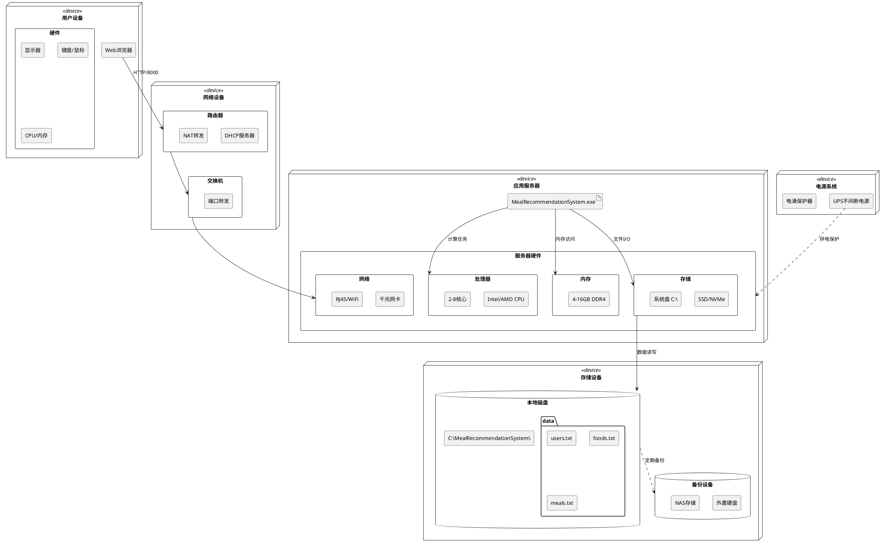

# 第7章 硬件系统维护

## 说明

智能配餐推荐系统作为一个软件系统，其硬件维护主要关注运行该系统的计算机设备和相关硬件基础设施。本章将硬件维护内容调整为符合本项目实际情况的内容，重点关注：
- 运行服务器/PC的硬件维护
- 网络设备的日常维护
- 存储设备的管理
- 备份设备的维护

---

## 7.1 系统硬件概述

### 7.1.1 系统简介

智能配餐推荐系统运行在Windows平台上，其硬件基础设施包括：

**1. 核心硬件组件**

```
应用服务器/PC
├── 处理器(CPU)
│   ├─ 功能: 执行程序代码、处理推荐算法
│   ├─ 要求: 多核处理器，2.0 GHz以上
│   └─ 重要性: ★★★★★ (核心组件)
│
├── 内存(RAM)
│   ├─ 功能: 提供快速数据访问、缓存
│   ├─ 要求: 4GB最低，8GB推荐，16GB最佳
│   └─ 重要性: ★★★★☆ (影响性能)
│
├── 存储设备(SSD/HDD)
│   ├─ 功能: 持久化存储数据文件
│   ├─ 要求: 1GB可用空间最低，10GB推荐
│   └─ 重要性: ★★★★★ (数据安全)
│
├── 网络适配器
│   ├─ 功能: 网络通信
│   ├─ 要求: 100 Mbps以上
│   └─ 重要性: ★★★★☆ (连接性)
│
├── 主板
│   ├─ 功能: 连接所有硬件组件
│   ├─ 要求: 支持现代接口标准
│   └─ 重要性: ★★★☆☆ (稳定性)
│
├── 电源(PSU)
│   ├─ 功能: 提供稳定电力
│   ├─ 要求: 功率充足，带保护功能
│   └─ 重要性: ★★★★☆ (可靠性)
│
└── 散热系统
    ├─ 功能: 保持设备正常工作温度
    ├─ 要求: 风扇正常运转，散热良好
    └─ 重要性: ★★★★☆ (稳定运行)
```

**2. 外围设备**

```
输入设备
  • 键盘: 用于系统配置和管理
  • 鼠标: 用于图形界面操作

输出设备
  • 显示器: 用于监控系统状态

存储设备（可选）
  • 外置硬盘: 用于数据备份
  • U盘: 用于数据传输
  • NAS: 网络存储（企业级部署）

网络设备
  • 路由器: 提供网络连接
  • 交换机: 多设备网络（可选）
  • 网线: 有线网络连接
```

**3. 硬件配置级别**

| 级别 | CPU | 内存 | 存储 | 适用场景 |
|-----|-----|------|------|---------|
| **基础配置** | 双核 2.0GHz | 4GB | HDD 1GB | 学习测试 |
| **标准配置** | 四核 3.0GHz | 8GB | SSD 10GB | 小规模部署 |
| **高性能配置** | 八核 3.5GHz | 16GB | NVMe SSD 50GB | 生产环境 |
| **企业级配置** | 多路服务器 | 32GB+ | RAID阵列 | 大规模部署 |

### 7.1.2 系统架构

**硬件系统架构图**：

```
┌────────────────────────────────────────────────────────────────┐
│                       硬件架构层次                              │
└────────────────────────────────────────────────────────────────┘

┌────────────────────────────────────────────────────────────────┐
│ 第一层：用户交互硬件                                            │
├────────────────────────────────────────────────────────────────┤
│                                                                │
│  ┌──────────┐  ┌──────────┐  ┌──────────┐  ┌──────────┐      │
│  │ 桌面PC   │  │ 笔记本   │  │ 移动设备 │  │ 平板电脑 │      │
│  └────┬─────┘  └────┬─────┘  └────┬─────┘  └────┬─────┘      │
│       │             │             │             │             │
│    [浏览器]      [浏览器]      [浏览器]      [浏览器]         │
│                                                                │
└────────┬──────────────┬──────────────┬──────────────┬─────────┘
         │              │              │              │
         └──────────────┴──────────────┴──────────────┘
                         │
                    [网络连接]
                         │
┌────────────────────────┴───────────────────────────────────────┐
│ 第二层：网络基础设施硬件                                        │
├────────────────────────────────────────────────────────────────┤
│                                                                │
│   ┌───────────────┐    ┌───────────────┐    ┌──────────────┐ │
│   │   路由器      │───│   交换机      │───│   防火墙     │ │
│   │ (DHCP/NAT)    │    │ (有线/无线)   │    │ (可选)       │ │
│   └───────────────┘    └───────────────┘    └──────────────┘ │
│                                                                │
└────────────────────────┬───────────────────────────────────────┘
                         │
                    [局域网/互联网]
                         │
┌────────────────────────▼───────────────────────────────────────┐
│ 第三层：应用服务器硬件（核心层）                                │
├────────────────────────────────────────────────────────────────┤
│                                                                │
│  ┌──────────────────────────────────────────────────────────┐ │
│  │              Windows PC / Server                         │ │
│  │  ┌────────────────────────────────────────────────────┐  │ │
│  │  │                                                    │  │ │
│  │  │   ┌──────────┐  ┌──────────┐  ┌──────────┐       │  │ │
│  │  │   │   CPU    │  │   RAM    │  │   GPU    │       │  │ │
│  │  │   │ (处理器) │  │ (内存)   │  │ (可选)   │       │  │ │
│  │  │   └──────────┘  └──────────┘  └──────────┘       │  │ │
│  │  │                                                    │  │ │
│  │  │   ┌──────────────────────────────────────┐        │  │ │
│  │  │   │           主板 (Motherboard)         │        │  │ │
│  │  │   │  • PCIe 插槽  • SATA 接口           │        │  │ │
│  │  │   │  • USB 接口   • 网络接口            │        │  │ │
│  │  │   └──────────────────────────────────────┘        │  │ │
│  │  │                                                    │  │ │
│  │  │   ┌──────────┐  ┌──────────┐  ┌──────────┐       │  │ │
│  │  │   │  SSD/HDD │  │  网卡    │  │  电源    │       │  │ │
│  │  │   │ (存储)   │  │ (网络)   │  │  (PSU)   │       │  │ │
│  │  │   └──────────┘  └──────────┘  └──────────┘       │  │ │
│  │  │                                                    │  │ │
│  │  │   ┌──────────────────────────────────────┐        │  │ │
│  │  │   │         散热系统 (Cooling)           │        │  │ │
│  │  │   │  • CPU风扇  • 机箱风扇  • 散热片    │        │  │ │
│  │  │   └──────────────────────────────────────┘        │  │ │
│  │  │                                                    │  │ │
│  │  └────────────────────────────────────────────────────┘  │ │
│  │                                                          │ │
│  │  ┌────────────────────────────────────────────────────┐ │ │
│  │  │           外设接口                                 │ │ │
│  │  │  • USB接口  • 音频接口  • 视频接口               │ │ │
│  │  └────────────────────────────────────────────────────┘ │ │
│  └──────────────────────────────────────────────────────────┘ │
│                                                                │
└────────────────────────┬───────────────────────────────────────┘
                         │
                    [数据连接]
                         │
┌────────────────────────▼───────────────────────────────────────┐
│ 第四层：存储硬件                                                │
├────────────────────────────────────────────────────────────────┤
│                                                                │
│  ┌──────────────┐  ┌──────────────┐  ┌──────────────┐        │
│  │ 内部存储     │  │ 外部存储     │  │ 网络存储     │        │
│  │ • SSD        │  │ • 外置硬盘   │  │ • NAS        │        │
│  │ • HDD        │  │ • U盘        │  │ • 云存储     │        │
│  │ • M.2 NVMe   │  │ • 移动硬盘   │  │ • SAN        │        │
│  └──────────────┘  └──────────────┘  └──────────────┘        │
│                                                                │
└────────────────────────────────────────────────────────────────┘

┌────────────────────────────────────────────────────────────────┐
│ 第五层：电源与保护                                              │
├────────────────────────────────────────────────────────────────┤
│                                                                │
│  ┌──────────────┐  ┌──────────────┐  ┌──────────────┐        │
│  │ 主电源       │  │ UPS不间断    │  │ 电涌保护器   │        │
│  │ (220V AC)    │  │ 电源(可选)   │  │ (推荐)       │        │
│  └──────────────┘  └──────────────┘  └──────────────┘        │
│                                                                │
└────────────────────────────────────────────────────────────────┘
```

**硬件连接关系图**：

```
                    ┌─────────────┐
                    │  显示器     │
                    │  (Monitor)  │
                    └──────┬──────┘
                           │ HDMI/DP
    ┌──────────────────────┼──────────────────────┐
    │                      ▼                      │
    │  ┌────────────────────────────────────┐    │
    │  │           显卡 / 集成显卡          │    │
    │  └────────────────────────────────────┘    │
    │                                             │
┌───┴──────┐  ┌────────────┐  ┌────────────┐    │
│  键盘    │  │  鼠标      │  │  网线      │    │
└───┬──────┘  └──────┬─────┘  └──────┬─────┘    │
    │ USB           │ USB           │ RJ45      │
    └───────────────┴───────────────┴───────┐   │
                                            │   │
    ┌───────────────────────────────────────┼───┘
    │               主板 (Motherboard)      │
    │  ┌──────────────────────────────────┐│
    │  │                                  ││
    │  │   ┌──────┐    ┌─────────────┐   ││
    │  │   │ CPU  │←───│ CPU散热器   │   ││
    │  │   └───┬──┘    └─────────────┘   ││
    │  │       │                          ││
    │  │   ┌───▼──────────────┐          ││
    │  │   │   CPU插槽        │          ││
    │  │   └──────────────────┘          ││
    │  │                                  ││
    │  │   ┌──────────────────┐          ││
    │  │   │  内存插槽 (RAM)  │          ││
    │  │   │  [DIMM1][DIMM2]  │          ││
    │  │   └──────────────────┘          ││
    │  │                                  ││
    │  │   ┌──────────────────┐          ││
    │  │   │  PCIe 插槽       │          ││
    │  │   │  (显卡/网卡)     │          ││
    │  │   └──────────────────┘          ││
    │  │                                  ││
    │  │   ┌──────────────────┐          ││
    │  │   │  SATA 接口       │          ││
    │  │   │  (硬盘/SSD)      │───────────┼──→ SSD/HDD
    │  │   └──────────────────┘          ││
    │  │                                  ││
    │  │   ┌──────────────────┐          ││
    │  │   │  M.2 插槽        │          ││
    │  │   │  (NVMe SSD)      │          ││
    │  │   └──────────────────┘          ││
    │  │                                  ││
    │  │   ┌──────────────────┐          ││
    │  │   │  网络接口芯片    │          ││
    │  │   │  (Ethernet)      │          ││
    │  │   └──────────────────┘          ││
    │  │                                  ││
    │  │   ┌──────────────────┐          ││
    │  │   │  USB 控制器      │          ││
    │  │   └──────────────────┘          ││
    │  │                                  ││
    │  └──────────────────────────────────┘│
    │                                       │
    │   ┌───────────────────────────────┐  │
    │   │  24pin 电源接口               │  │
    │   └───────────┬───────────────────┘  │
    └───────────────┼──────────────────────┘
                    │
            ┌───────▼────────┐
            │   电源 (PSU)   │
            │   (Power       │
            │    Supply)     │
            └───────┬────────┘
                    │ AC 220V
            ┌───────▼────────┐
            │   墙壁插座     │
            │   (或UPS)      │
            └────────────────┘
```

**UML部署图（硬件视角）**：



---

## 7.2 日常维护

日常维护是保证硬件系统稳定运行的基础工作，应该建立规范的维护流程和检查清单。

### 7.2.1 外观检查

**每日外观检查计划表**

| 检查时间 | 检查项目 | 检查标准 | 检查人 | 异常处理 |
|---------|---------|---------|--------|---------|
| 上午9:00 | 机箱外壳 | 无损坏、变形 | 运维人员 | 记录并报修 |
| 上午9:05 | 电源指示灯 | 绿灯常亮 | 运维人员 | 检查电源连接 |
| 上午9:10 | 散热风扇 | 正常转动、无异响 | 运维人员 | 清理或更换 |
| 上午9:15 | 显示器 | 显示清晰、无黑屏 | 运维人员 | 检查连接线 |
| 上午9:20 | 键盘鼠标 | 功能正常 | 运维人员 | 更换或修复 |
| 上午9:25 | 网络连接线 | 接头牢固、指示灯亮 | 运维人员 | 重新插拔 |
| 上午9:30 | 机箱温度 | 手感温热、不烫手 | 运维人员 | 加强散热 |

**外观检查详细内容**：

```
1. 机箱外壳检查
   □ 外壳是否有明显划痕、凹陷或裂纹
   □ 机箱侧板是否牢固，螺丝是否松动
   □ 前面板、后面板是否完整无缺损
   □ 机箱接缝处是否有灰尘积聚
   □ 机箱底部防滑垫是否完好

2. 指示灯检查
   □ 电源指示灯状态（应为绿灯常亮）
      • 红灯: 电源故障或过热
      • 闪烁: 硬盘活动正常
      • 不亮: 电源未接通或故障
   □ 硬盘指示灯状态（工作时闪烁）
   □ 网络指示灯状态（连接时常亮或闪烁）

3. 散热系统检查
   □ CPU风扇是否正常转动
      • 正常: 匀速旋转，声音平稳
      • 异常: 停转、异响、转速不稳
   □ 机箱风扇是否正常工作
   □ 散热孔是否有灰尘堵塞
   □ 风扇叶片是否有积尘
   □ 散热片是否有灰尘覆盖

4. 进风口和出风口检查
   □ 前面板进风口是否通畅
   □ 后面板出风口是否被遮挡
   □ 进风口过滤网是否干净（如有）
   □ 周围是否有足够的散热空间（至少10cm）

5. 显示器检查
   □ 显示器电源指示灯是否正常
   □ 屏幕显示是否清晰
   □ 是否有亮点、暗点或坏点
   □ 屏幕边框是否有损坏
   □ 显示器支架是否稳固

6. 线缆检查
   □ 电源线是否完好无破损
   □ 视频线（HDMI/DP/VGA）是否连接牢固
   □ 网线是否完好，水晶头无损坏
   □ USB线是否插紧
   □ 所有线缆是否整理有序，无缠绕

7. 外设检查
   □ 键盘按键是否正常，无卡键
   □ 鼠标移动是否流畅，按键灵敏
   □ 键盘和鼠标表面是否清洁
   □ USB接口是否插紧

8. 环境检查
   □ 设备周围是否有杂物堆积
   □ 是否有液体溢出风险
   □ 温度和湿度是否适宜
   □ 是否有直射阳光照射设备
   □ 是否有强烈的振动源附近
```

**外观检查记录表模板**：

```
┌─────────────────────────────────────────────────────────────┐
│            硬件系统外观检查记录表                            │
├─────────────────────────────────────────────────────────────┤
│ 日期: _____________  检查人: _____________  时间: _________ │
├──────────┬──────────┬──────────┬──────────┬────────────────┤
│ 检查项目 │ 检查标准 │ 实际状态 │ 是否正常 │ 备注           │
├──────────┼──────────┼──────────┼──────────┼────────────────┤
│ 机箱外壳 │ 无损伤   │          │ □是□否  │                │
├──────────┼──────────┼──────────┼──────────┼────────────────┤
│ 电源灯   │ 绿灯亮   │          │ □是□否  │                │
├──────────┼──────────┼──────────┼──────────┼────────────────┤
│ CPU风扇  │ 正常转动 │          │ □是□否  │                │
├──────────┼──────────┼──────────┼──────────┼────────────────┤
│ 机箱风扇 │ 正常转动 │          │ □是□否  │                │
├──────────┼──────────┼──────────┼──────────┼────────────────┤
│ 显示器   │ 显示清晰 │          │ □是□否  │                │
├──────────┼──────────┼──────────┼──────────┼────────────────┤
│ 键盘     │ 功能正常 │          │ □是□否  │                │
├──────────┼──────────┼──────────┼──────────┼────────────────┤
│ 鼠标     │ 功能正常 │          │ □是□否  │                │
├──────────┼──────────┼──────────┼──────────┼────────────────┤
│ 电源线   │ 无破损   │          │ □是□否  │                │
├──────────┼──────────┼──────────┼──────────┼────────────────┤
│ 网线     │ 连接牢固 │          │ □是□否  │                │
├──────────┼──────────┼──────────┼──────────┼────────────────┤
│ 散热孔   │ 无堵塞   │          │ □是□否  │                │
└──────────┴──────────┴──────────┴──────────┴────────────────┘

异常情况说明:
___________________________________________________________________
___________________________________________________________________

处理措施:
___________________________________________________________________
___________________________________________________________________

复查时间: _____________  复查人: _____________

签字确认: _____________  日期: _____________
```

**PowerShell外观检查辅助脚本**：

```powershell
# 硬件外观检查辅助脚本: hardware_visual_check.ps1

Write-Host "========================================" -ForegroundColor Cyan
Write-Host "硬件外观检查辅助工具" -ForegroundColor Cyan
Write-Host "========================================" -ForegroundColor Cyan
Write-Host ""

# 检查系统运行状态
Write-Host "[1/5] 检查系统运行状态..." -ForegroundColor Yellow
$os = Get-CimInstance Win32_OperatingSystem
$uptime = (Get-Date) - $os.LastBootUpTime
Write-Host "  系统运行时间: $($uptime.Days)天 $($uptime.Hours)小时 $($uptime.Minutes)分钟" -ForegroundColor Green
Write-Host ""

# 检查温度（需要OpenHardwareMonitor或其他工具）
Write-Host "[2/5] 检查硬件温度..." -ForegroundColor Yellow
Write-Host "  提示: 请手动检查机箱温度（触摸检查）" -ForegroundColor Gray
Write-Host "  正常: 温热但不烫手 (30-50°C)" -ForegroundColor Gray
Write-Host "  警告: 明显发烫 (>60°C)" -ForegroundColor Gray
Write-Host ""

# 检查风扇（通过WMI - 部分主板支持）
Write-Host "[3/5] 检查风扇状态..." -ForegroundColor Yellow
try {
    $fans = Get-WmiObject -Namespace root\WMI -Class MSAcpi_ThermalZoneTemperature -ErrorAction Stop
    if ($fans) {
        Write-Host "  ✓ 检测到散热设备" -ForegroundColor Green
    }
} catch {
    Write-Host "  ⚠ 无法通过WMI检测风扇状态" -ForegroundColor Yellow
    Write-Host "  请目视检查风扇是否转动，耳听是否有异响" -ForegroundColor Gray
}
Write-Host ""

# 检查USB设备
Write-Host "[4/5] 检查USB设备连接..." -ForegroundColor Yellow
$usbDevices = Get-PnpDevice | Where-Object { $_.Class -eq "USB" -and $_.Status -eq "OK" }
Write-Host "  检测到 $($usbDevices.Count) 个USB设备" -ForegroundColor Green
$usbDevices | Select-Object -First 5 FriendlyName | ForEach-Object {
    Write-Host "    - $($_.FriendlyName)" -ForegroundColor Gray
}
Write-Host ""

# 检查显示器
Write-Host "[5/5] 检查显示器..." -ForegroundColor Yellow
$monitors = Get-WmiObject WmiMonitorID -Namespace root\wmi -ErrorAction SilentlyContinue
if ($monitors) {
    $monitorCount = $monitors.Count
    Write-Host "  检测到 $monitorCount 个显示器" -ForegroundColor Green
} else {
    Write-Host "  无法检测显示器信息" -ForegroundColor Yellow
}
Write-Host ""

Write-Host "========================================" -ForegroundColor Cyan
Write-Host "硬件外观检查提示完成" -ForegroundColor Cyan
Write-Host "========================================" -ForegroundColor Cyan
Write-Host ""
Write-Host "请根据检查清单进行人工目视检查，并记录在检查表中" -ForegroundColor Yellow
```

### 7.2.2 连接检查

**连接检查计划表**：

| 时间 | 检查项目 | 检查频率 | 检查标准 | 负责人 |
|-----|---------|---------|---------|--------|
| 每日9:30 | 电源连接 | 每天 | 连接紧固、无松动 | 运维人员 |
| 每日9:35 | 网络连接 | 每天 | 网线插牢、指示灯亮 | 网络管理员 |
| 每日9:40 | 存储设备 | 每天 | SATA/M.2连接正常 | 系统管理员 |
| 每日9:45 | 显示连接 | 每天 | 视频线牢固、无松动 | 运维人员 |
| 每日9:50 | USB设备 | 每天 | 键鼠正常、接口无松动 | 运维人员 |
| 每周一 | 内部连接 | 每周 | 打开机箱检查内部连接 | 硬件工程师 |

**详细连接检查内容**：

```
A. 电源连接检查
   □ 主电源线（220V AC）
      • 插头与插座连接牢固
      • 插头无烧焦痕迹
      • 电源线无破损、老化
      • 插座无松动
   
   □ 主板24pin电源连接
      • 连接器完全插入
      • 卡扣锁定到位
      • 线缆无明显拉扯
   
   □ CPU 4/8pin电源连接
      • 连接器牢固插入
      • 位置正确（靠近CPU插槽）
   
   □ 显卡6/8pin电源（如有）
      • 所有电源接口已连接
      • 连接牢固
   
   □ SATA电源连接
      • 硬盘/SSD电源插头插紧
      • 连接器无松动

B. 数据连接检查
   □ SATA数据线
      • 主板端连接牢固
      • 硬盘/SSD端连接牢固
      • 线缆无弯折、损坏
      • 使用正确的SATA接口（SATA3优先）
   
   □ M.2 NVMe连接
      • M.2 SSD完全插入插槽
      • 固定螺丝已拧紧
      • 散热片安装正确（如有）
   
   □ 内存条连接
      • 内存条完全插入
      • 两端卡扣锁定
      • 内存条无倾斜

C. 外部接口连接检查
   □ 网络连接
      • 网线RJ45接头插紧
      • 网卡指示灯状态正常
        - 链路灯: 常亮（已连接）
        - 活动灯: 闪烁（有数据传输）
      • 网线无破损、弯折
      • 水晶头无断裂
   
   □ 显示连接
      • HDMI/DP/VGA线连接牢固
      • 显示器端和主机端都插紧
      • 螺丝固定（VGA/DVI）
      • 线缆无拉扯
   
   □ USB设备连接
      • 键盘USB插头插紧
      • 鼠标USB插头插紧
      • 其他USB设备连接正常
      • USB接口无松动
   
   □ 音频连接（如需要）
      • 音频线插入正确接口
      • 耳机/音箱连接正常

D. 内部扩展卡连接检查（每周）
   □ 显卡（如有独显）
      • 完全插入PCIe插槽
      • 固定螺丝已拧紧
      • 电源线已连接
   
   □ 网卡（如有独立网卡）
      • 完全插入PCIe/PCI插槽
      • 固定螺丝已拧紧
   
   □ 其他扩展卡
      • 插入牢固
      • 固定可靠

E. 散热器连接检查（每周）
   □ CPU散热器
      • 固定扣具牢固
      • 风扇电源线已连接
      • 风扇转速正常
   
   □ 机箱风扇
      • 风扇固定螺丝已拧紧
      • 电源线已连接
      • 转速正常
```

**连接检查PowerShell脚本**：

```powershell
# 连接检查脚本: check_connections.ps1

Write-Host "========================================" -ForegroundColor Cyan
Write-Host "硬件连接检查工具" -ForegroundColor Cyan
Write-Host "========================================" -ForegroundColor Cyan
Write-Host ""

# 检查网络连接
Write-Host "[1/6] 检查网络连接..." -ForegroundColor Yellow
$adapters = Get-NetAdapter | Where-Object { $_.Status -eq "Up" }
if ($adapters) {
    Write-Host "  ✓ 找到 $($adapters.Count) 个活动网络适配器" -ForegroundColor Green
    foreach ($adapter in $adapters) {
        Write-Host "    - $($adapter.Name): $($adapter.LinkSpeed)" -ForegroundColor Gray
        
        # 检查网络连通性
        $pingResult = Test-Connection -ComputerName "8.8.8.8" -Count 1 -Quiet -ErrorAction SilentlyContinue
        if ($pingResult) {
            Write-Host "      ✓ 网络连通正常" -ForegroundColor Green
        } else {
            Write-Host "      ⚠ 网络连通异常" -ForegroundColor Yellow
        }
    }
} else {
    Write-Host "  ✗ 未找到活动的网络适配器" -ForegroundColor Red
}
Write-Host ""

# 检查磁盘连接
Write-Host "[2/6] 检查存储设备连接..." -ForegroundColor Yellow
$disks = Get-PhysicalDisk
Write-Host "  检测到 $($disks.Count) 个物理磁盘" -ForegroundColor Green
foreach ($disk in $disks) {
    $health = switch ($disk.HealthStatus) {
        "Healthy" { "健康"; $color = "Green" }
        "Warning" { "警告"; $color = "Yellow" }
        "Unhealthy" { "不健康"; $color = "Red" }
        default { "未知"; $color = "Gray" }
    }
    Write-Host "    - $($disk.FriendlyName): $health" -ForegroundColor $color
    Write-Host "      媒体类型: $($disk.MediaType), 总线类型: $($disk.BusType)" -ForegroundColor Gray
}
Write-Host ""

# 检查USB设备
Write-Host "[3/6] 检查USB设备连接..." -ForegroundColor Yellow
$usbDevices = Get-PnpDevice | Where-Object { 
    $_.Class -eq "USB" -and $_.Status -eq "OK" 
}
Write-Host "  检测到 $($usbDevices.Count) 个正常工作的USB设备" -ForegroundColor Green

$keyboards = Get-PnpDevice | Where-Object { $_.Class -eq "Keyboard" -and $_.Status -eq "OK" }
$mice = Get-PnpDevice | Where-Object { $_.Class -eq "Mouse" -and $_.Status -eq "OK" }
Write-Host "    - 键盘: $($keyboards.Count) 个" -ForegroundColor Gray
Write-Host "    - 鼠标: $($mice.Count) 个" -ForegroundColor Gray
Write-Host ""

# 检查显示器
Write-Host "[4/6] 检查显示器连接..." -ForegroundColor Yellow
try {
    $monitors = Get-WmiObject -Namespace root\wmi -Class WmiMonitorID -ErrorAction Stop
    Write-Host "  ✓ 检测到 $($monitors.Count) 个显示器" -ForegroundColor Green
} catch {
    Write-Host "  ⚠ 无法检测显示器信息" -ForegroundColor Yellow
}
Write-Host ""

# 检查PCI/PCIe设备
Write-Host "[5/6] 检查PCI/PCIe设备..." -ForegroundColor Yellow
$pciDevices = Get-PnpDevice | Where-Object { 
    $_.Class -in @("Display", "Net", "SCSIAdapter") -and $_.Status -eq "OK" 
}
Write-Host "  检测到 $($pciDevices.Count) 个PCI/PCIe设备正常工作" -ForegroundColor Green
$pciDevices | ForEach-Object {
    Write-Host "    - $($_.FriendlyName)" -ForegroundColor Gray
}
Write-Host ""

# 检查电源状态
Write-Host "[6/6] 检查电源状态..." -ForegroundColor Yellow
$battery = Get-WmiObject -Class Win32_Battery -ErrorAction SilentlyContinue
if ($battery) {
    Write-Host "  ⚠ 检测到电池设备（笔记本电脑）" -ForegroundColor Yellow
    Write-Host "    电池状态: $($battery.Status)" -ForegroundColor Gray
    Write-Host "    剩余电量: $($battery.EstimatedChargeRemaining)%" -ForegroundColor Gray
} else {
    Write-Host "  ✓ 台式机，使用市电供电" -ForegroundColor Green
}
Write-Host ""

Write-Host "========================================" -ForegroundColor Cyan
Write-Host "连接检查完成" -ForegroundColor Cyan
Write-Host "========================================" -ForegroundColor Cyan
Write-Host ""
Write-Host "建议: 每周打开机箱进行内部连接目视检查" -ForegroundColor Yellow
```

### 7.2.3 性能测试

**每日性能测试计划**：

| 时间 | 测试项目 | 测试工具 | 通过标准 | 频率 |
|-----|---------|---------|---------|------|
| 10:00 | CPU性能 | PowerShell | 使用率<80%, 温度<70°C | 每天 |
| 10:15 | 内存性能 | Windows性能监视器 | 可用内存>2GB | 每天 |
| 10:30 | 磁盘I/O | CrystalDiskMark | 读>300MB/s, 写>200MB/s (SSD) | 每天 |
| 10:45 | 网络性能 | ping/iperf | 延迟<50ms, 丢包<1% | 每天 |
| 11:00 | 应用响应 | 浏览器测试 | 页面加载<3秒 | 每天 |
| 14:00 | 综合压力测试 | 自定义脚本 | 所有指标正常 | 每周 |

**详细性能测试内容**：

```
1. CPU性能测试
   测试目的: 验证CPU工作正常，无过热或降频
   
   测试方法:
   □ 使用任务管理器查看CPU使用率
   □ 使用PowerShell脚本监控CPU状态
   □ 运行简单的计算任务测试性能
   
   通过标准:
   • 空闲时CPU使用率 < 10%
   • 负载时CPU使用率 < 80%
   • CPU温度 < 70°C (理想 < 60°C)
   • 无频率降低（未降频）
   • 所有核心工作正常
   
   异常处理:
   • 高温: 检查散热器，清理灰尘
   • 高使用率: 检查后台程序，查杀病毒
   • 降频: 检查电源设置，检查散热

2. 内存性能测试
   测试目的: 验证内存容量充足，无内存泄漏
   
   测试方法:
   □ 查看任务管理器内存使用情况
   □ 使用PowerShell脚本监控内存
   □ 检查虚拟内存使用情况
   
   通过标准:
   • 物理内存使用率 < 75%
   • 可用内存 > 2GB (推荐 > 4GB)
   • 无内存持续增长趋势
   • 虚拟内存使用 < 50%
   
   异常处理:
   • 内存不足: 关闭不必要的程序
   • 内存泄漏: 重启应用或系统
   • 考虑升级内存容量

3. 磁盘I/O性能测试
   测试目的: 验证磁盘读写正常，性能达标
   
   测试方法:
   □ 使用CrystalDiskMark测试读写速度
   □ 检查磁盘使用率和响应时间
   □ 使用CrystalDiskInfo检查SMART状态
   
   通过标准 (SSD):
   • 顺序读取 > 500 MB/s
   • 顺序写入 > 400 MB/s
   • 4K随机读取 > 30 MB/s
   • 磁盘使用时间 < 50ms
   • SMART状态: 健康
   
   通过标准 (HDD):
   • 顺序读取 > 100 MB/s
   • 顺序写入 > 80 MB/s
   • 磁盘使用时间 < 20ms
   • 无坏道
   
   异常处理:
   • 速度慢: 检查连接，优化系统
   • SMART警告: 立即备份，计划更换
   • 异响: 立即备份，停止使用

4. 网络性能测试
   测试目的: 验证网络连接稳定，延迟低
   
   测试方法:
   □ 使用ping测试延迟
   □ 使用iperf测试带宽
   □ 检查数据包丢失率
   
   通过标准:
   • 本地网络延迟 < 5ms
   • 互联网延迟 < 50ms
   • 丢包率 < 0.5%
   • 带宽达到接口速率的 80%以上
   
   异常处理:
   • 高延迟: 检查网络设备，检查网线
   • 丢包: 更换网线，重启路由器
   • 低带宽: 检查网络配置，检查干扰

5. 应用响应性能测试
   测试目的: 验证智能配餐系统响应正常
   
   测试方法:
   □ 访问 http://localhost:8000
   □ 测试登录功能
   □ 测试推荐生成功能
   □ 记录响应时间
   
   通过标准:
   • 页面加载时间 < 3秒
   • API响应时间 < 1秒
   • 推荐生成时间 < 5秒
   • 无错误提示
   
   异常处理:
   • 响应慢: 检查CPU/内存使用率
   • 错误: 查看错误日志，重启服务
   • 无响应: 检查进程，重启应用
```

**综合性能测试脚本**：

```powershell
# 综合性能测试脚本: performance_test.ps1

param(
    [switch]$Detailed = $false,
    [string]$LogFile = "C:\MealRecommendationSystem\logs\performance_test_$(Get-Date -Format 'yyyyMMdd').log"
)

function Write-TestLog {
    param([string]$Message, [string]$Level = "INFO")
    
    $timestamp = Get-Date -Format "yyyy-MM-dd HH:mm:ss"
    $logEntry = "[$timestamp] [$Level] $Message"
    Add-Content -Path $LogFile -Value $logEntry
    
    $color = switch ($Level) {
        "PASS" { "Green" }
        "FAIL" { "Red" }
        "WARN" { "Yellow" }
        default { "White" }
    }
    Write-Host $logEntry -ForegroundColor $color
}

Write-Host "========================================" -ForegroundColor Cyan
Write-Host "   智能配餐系统 - 硬件性能测试" -ForegroundColor Cyan
Write-Host "========================================" -ForegroundColor Cyan
Write-Host ""

$testsPassed = 0
$testsFailed = 0
$testsWarning = 0

# 测试1: CPU性能
Write-Host "[测试 1/6] CPU性能测试..." -ForegroundColor Yellow
$cpu = Get-Counter '\Processor(_Total)\% Processor Time'
$cpuUsage = [math]::Round($cpu.CounterSamples[0].CookedValue, 2)
Write-Host "  CPU使用率: $cpuUsage%" -ForegroundColor Gray

if ($cpuUsage -lt 80) {
    Write-TestLog "CPU使用率测试通过: $cpuUsage%" "PASS"
    $testsPassed++
} else {
    Write-TestLog "CPU使用率过高: $cpuUsage%" "FAIL"
    $testsFailed++
}

# CPU核心数
$cpuInfo = Get-WmiObject Win32_Processor
Write-Host "  CPU型号: $($cpuInfo.Name)" -ForegroundColor Gray
Write-Host "  核心数: $($cpuInfo.NumberOfCores)" -ForegroundColor Gray
Write-Host "  线程数: $($cpuInfo.NumberOfLogicalProcessors)" -ForegroundColor Gray
Write-Host ""

# 测试2: 内存性能
Write-Host "[测试 2/6] 内存性能测试..." -ForegroundColor Yellow
$os = Get-CimInstance Win32_OperatingSystem
$totalMem = [math]::Round($os.TotalVisibleMemorySize / 1MB, 2)
$freeMem = [math]::Round($os.FreePhysicalMemory / 1MB, 2)
$usedMem = $totalMem - $freeMem
$memUsage = [math]::Round(($usedMem / $totalMem) * 100, 2)

Write-Host "  总内存: $totalMem GB" -ForegroundColor Gray
Write-Host "  已用内存: $usedMem GB ($memUsage%)" -ForegroundColor Gray
Write-Host "  可用内存: $freeMem GB" -ForegroundColor Gray

if ($memUsage -lt 75 -and $freeMem -gt 2) {
    Write-TestLog "内存测试通过: 使用率$memUsage%, 可用${freeMem}GB" "PASS"
    $testsPassed++
} elseif ($memUsage -lt 85) {
    Write-TestLog "内存使用率偏高: $memUsage%" "WARN"
    $testsWarning++
} else {
    Write-TestLog "内存不足: 使用率$memUsage%, 可用${freeMem}GB" "FAIL"
    $testsFailed++
}
Write-Host ""

# 测试3: 磁盘性能
Write-Host "[测试 3/6] 磁盘性能测试..." -ForegroundColor Yellow
$disks = Get-PhysicalDisk
foreach ($disk in $disks) {
    Write-Host "  磁盘: $($disk.FriendlyName)" -ForegroundColor Gray
    Write-Host "    媒体类型: $($disk.MediaType)" -ForegroundColor Gray
    Write-Host "    健康状态: $($disk.HealthStatus)" -ForegroundColor Gray
    Write-Host "    操作状态: $($disk.OperationalStatus)" -ForegroundColor Gray
    
    if ($disk.HealthStatus -eq "Healthy") {
        Write-TestLog "磁盘健康检查通过: $($disk.FriendlyName)" "PASS"
        $testsPassed++
    } else {
        Write-TestLog "磁盘健康异常: $($disk.FriendlyName) - $($disk.HealthStatus)" "FAIL"
        $testsFailed++
    }
}

# 检查磁盘空间
$cDrive = Get-PSDrive C
$totalSpace = [math]::Round(($cDrive.Used + $cDrive.Free) / 1GB, 2)
$freeSpace = [math]::Round($cDrive.Free / 1GB, 2)
$usedPercent = [math]::Round(($cDrive.Used / ($cDrive.Used + $cDrive.Free)) * 100, 2)

Write-Host "  C盘空间:" -ForegroundColor Gray
Write-Host "    总容量: $totalSpace GB" -ForegroundColor Gray
Write-Host "    已使用: $usedPercent%" -ForegroundColor Gray
Write-Host "    剩余: $freeSpace GB" -ForegroundColor Gray

if ($usedPercent -lt 85 -and $freeSpace -gt 5) {
    Write-TestLog "磁盘空间充足: 剩余${freeSpace}GB (${usedPercent}%已用)" "PASS"
    $testsPassed++
} elseif ($usedPercent -lt 90) {
    Write-TestLog "磁盘空间紧张: 剩余${freeSpace}GB" "WARN"
    $testsWarning++
} else {
    Write-TestLog "磁盘空间不足: 剩余${freeSpace}GB" "FAIL"
    $testsFailed++
}
Write-Host ""

# 测试4: 网络性能
Write-Host "[测试 4/6] 网络性能测试..." -ForegroundColor Yellow
$adapters = Get-NetAdapter | Where-Object { $_.Status -eq "Up" }
Write-Host "  活动网络适配器: $($adapters.Count)" -ForegroundColor Gray

foreach ($adapter in $adapters) {
    Write-Host "    - $($adapter.Name): $($adapter.LinkSpeed)" -ForegroundColor Gray
}

# Ping测试
Write-Host "  测试网络延迟..." -ForegroundColor Gray
try {
    $pingResult = Test-Connection -ComputerName "8.8.8.8" -Count 4
    $avgLatency = ($pingResult | Measure-Object -Property ResponseTime -Average).Average
    Write-Host "    平均延迟: $([math]::Round($avgLatency, 2)) ms" -ForegroundColor Gray
    
    if ($avgLatency -lt 50) {
        Write-TestLog "网络延迟测试通过: $([math]::Round($avgLatency, 2))ms" "PASS"
        $testsPassed++
    } elseif ($avgLatency -lt 100) {
        Write-TestLog "网络延迟偏高: $([math]::Round($avgLatency, 2))ms" "WARN"
        $testsWarning++
    } else {
        Write-TestLog "网络延迟过高: $([math]::Round($avgLatency, 2))ms" "FAIL"
        $testsFailed++
    }
} catch {
    Write-TestLog "网络测试失败: 无法连接到测试服务器" "FAIL"
    $testsFailed++
}
Write-Host ""

# 测试5: 系统稳定性
Write-Host "[测试 5/6] 系统稳定性测试..." -ForegroundColor Yellow
$uptime = (Get-Date) - $os.LastBootUpTime
Write-Host "  系统运行时间: $($uptime.Days)天 $($uptime.Hours)小时 $($uptime.Minutes)分钟" -ForegroundColor Gray

# 检查最近的系统事件错误
$recentErrors = Get-EventLog -LogName System -EntryType Error -Newest 10 -ErrorAction SilentlyContinue
if ($recentErrors) {
    Write-Host "  最近的系统错误: $($recentErrors.Count) 个" -ForegroundColor Yellow
    if ($Detailed) {
        $recentErrors | Select-Object -First 3 | ForEach-Object {
            Write-Host "    [$($_.TimeGenerated)] $($_.Message.Substring(0, [Math]::Min(80, $_.Message.Length)))..." -ForegroundColor Gray
        }
    }
    
    if ($recentErrors.Count -gt 5) {
        Write-TestLog "系统稳定性: 发现较多错误事件($($recentErrors.Count)个)" "WARN"
        $testsWarning++
    } else {
        Write-TestLog "系统稳定性: 少量错误事件($($recentErrors.Count)个)" "PASS"
        $testsPassed++
    }
} else {
    Write-TestLog "系统稳定性: 无最近错误事件" "PASS"
    $testsPassed++
}
Write-Host ""

# 测试6: 应用服务性能
Write-Host "[测试 6/6] 应用服务性能测试..." -ForegroundColor Yellow
$process = Get-Process -Name "MealRecommendationSystem" -ErrorAction SilentlyContinue
if ($process) {
    Write-Host "  ✓ 应用进程运行中" -ForegroundColor Green
    Write-Host "    进程内存: $([math]::Round($process.WorkingSet64 / 1MB, 2)) MB" -ForegroundColor Gray
    Write-Host "    线程数: $($process.Threads.Count)" -ForegroundColor Gray
    Write-Host "    CPU时间: $([math]::Round($process.CPU, 2)) 秒" -ForegroundColor Gray
    
    # 测试HTTP响应
    Write-Host "  测试HTTP服务响应..." -ForegroundColor Gray
    $sw = [System.Diagnostics.Stopwatch]::StartNew()
    try {
        $response = Invoke-WebRequest -Uri "http://localhost:8000" -UseBasicParsing -TimeoutSec 10
        $sw.Stop()
        $responseTime = $sw.ElapsedMilliseconds
        
        Write-Host "    响应时间: $responseTime ms" -ForegroundColor Gray
        Write-Host "    HTTP状态: $($response.StatusCode)" -ForegroundColor Gray
        
        if ($responseTime -lt 1000 -and $response.StatusCode -eq 200) {
            Write-TestLog "应用服务测试通过: 响应时间${responseTime}ms" "PASS"
            $testsPassed++
        } elseif ($responseTime -lt 3000) {
            Write-TestLog "应用服务响应较慢: ${responseTime}ms" "WARN"
            $testsWarning++
        } else {
            Write-TestLog "应用服务响应超时: ${responseTime}ms" "FAIL"
            $testsFailed++
        }
    } catch {
        Write-TestLog "应用服务测试失败: 无法访问HTTP服务" "FAIL"
        $testsFailed++
    }
} else {
    Write-Host "  ✗ 应用进程未运行" -ForegroundColor Red
    Write-TestLog "应用服务测试失败: 进程未运行" "FAIL"
    $testsFailed++
}
Write-Host ""

# 测试总结
$totalTests = $testsPassed + $testsFailed + $testsWarning
Write-Host "========================================" -ForegroundColor Cyan
Write-Host "测试总结" -ForegroundColor Cyan
Write-Host "========================================" -ForegroundColor Cyan
Write-Host "总测试数: $totalTests" -ForegroundColor White
Write-Host "通过: $testsPassed" -ForegroundColor Green
Write-Host "警告: $testsWarning" -ForegroundColor Yellow
Write-Host "失败: $testsFailed" -ForegroundColor Red
Write-Host ""

if ($testsFailed -eq 0 -and $testsWarning -eq 0) {
    Write-Host "✓ 所有测试通过，系统运行正常" -ForegroundColor Green
    $exitCode = 0
} elseif ($testsFailed -eq 0) {
    Write-Host "⚠ 测试完成，有 $testsWarning 个警告项" -ForegroundColor Yellow
    $exitCode = 1
} else {
    Write-Host "✗ 测试失败，有 $testsFailed 个失败项" -ForegroundColor Red
    $exitCode = 2
}

Write-Host ""
Write-Host "详细日志已保存到: $LogFile" -ForegroundColor Gray
Write-Host "========================================" -ForegroundColor Cyan

exit $exitCode
```

**性能测试记录表**：

```
┌─────────────────────────────────────────────────────────────────┐
│               硬件性能测试记录表                                 │
├─────────────────────────────────────────────────────────────────┤
│ 测试日期: _____________  测试人: _____________  时间: _________ │
├──────────┬──────────┬──────────┬──────────┬────────────────────┤
│ 测试项目 │ 测试结果 │ 通过标准 │ 是否通过 │ 备注               │
├──────────┼──────────┼──────────┼──────────┼────────────────────┤
│ CPU使用率│         %│ < 80%    │ □是□否  │                    │
├──────────┼──────────┼──────────┼──────────┼────────────────────┤
│ CPU温度  │        °C│ < 70°C   │ □是□否  │                    │
├──────────┼──────────┼──────────┼──────────┼────────────────────┤
│ 内存使用 │        GB│ >2GB可用 │ □是□否  │                    │
├──────────┼──────────┼──────────┼──────────┼────────────────────┤
│ 内存使用率│        %│ < 75%    │ □是□否  │                    │
├──────────┼──────────┼──────────┼──────────┼────────────────────┤
│ 磁盘读取 │      MB/s│ >300MB/s │ □是□否  │ SSD标准            │
├──────────┼──────────┼──────────┼──────────┼────────────────────┤
│ 磁盘写入 │      MB/s│ >200MB/s │ □是□否  │ SSD标准            │
├──────────┼──────────┼──────────┼──────────┼────────────────────┤
│ 磁盘空间 │        GB│ >5GB可用 │ □是□否  │                    │
├──────────┼──────────┼──────────┼──────────┼────────────────────┤
│ 网络延迟 │        ms│ < 50ms   │ □是□否  │                    │
├──────────┼──────────┼──────────┼──────────┼────────────────────┤
│ 网络丢包 │         %│ < 1%     │ □是□否  │                    │
├──────────┼──────────┼──────────┼──────────┼────────────────────┤
│ HTTP响应 │        ms│ < 1000ms │ □是□否  │                    │
└──────────┴──────────┴──────────┴──────────┴────────────────────┘

整体评估: □优秀  □良好  □一般  □需改进

异常情况说明:
___________________________________________________________________
___________________________________________________________________

处理措施:
___________________________________________________________________
___________________________________________________________________

下次测试时间: _____________

签字确认: _____________  日期: _____________
```

---

## 7.3 定期维护

定期维护是保障硬件系统长期稳定运行的重要措施，需要制定详细的维护计划并严格执行。

### 7.3.1 清洁保养

**清洁保养计划表**：

| 维护项目 | 频率 | 负责人 | 所需工具 | 预计时间 |
|---------|------|--------|---------|---------|
| 外壳清洁 | 每月 | 运维人员 | 软布、清洁剂 | 15分钟 |
| 键盘鼠标清洁 | 每月 | 运维人员 | 清洁液、棉签 | 20分钟 |
| 显示器清洁 | 每月 | 运维人员 | 专用清洁液、软布 | 10分钟 |
| 机箱内部除尘 | 每季度 | 硬件工程师 | 压缩空气罐、防静电刷 | 30-45分钟 |
| 散热器清洁 | 每季度 | 硬件工程师 | 压缩空气罐、刷子 | 20分钟 |
| 风扇清洁 | 每季度 | 硬件工程师 | 压缩空气罐、润滑油 | 25分钟 |
| 接口清洁 | 每半年 | 硬件工程师 | 接触清洁剂、棉签 | 15分钟 |
| 深度清洁 | 每年 | 硬件工程师 | 全套工具 | 2-3小时 |

**详细清洁保养内容**：

```
1. 外壳清洁（每月）

所需工具:
  • 软布（超细纤维布）
  • 温和的清洁剂或专用电脑清洁液
  • 水（少量）

操作步骤:
  1. 关闭计算机并断开电源
  2. 等待设备完全冷却
  3. 用软布蘸少量清洁剂
  4. 轻轻擦拭机箱外壳
  5. 注意不要让液体进入机箱
  6. 用干布擦干
  7. 等待完全干燥后再开机

注意事项:
  ⚠ 不要使用腐蚀性强的清洁剂
  ⚠ 不要直接喷洒液体到设备上
  ⚠ 清洁时保持温柔，避免刮伤

2. 键盘鼠标清洁（每月）

键盘清洁:
  1. 关闭计算机或拔下键盘
  2. 倒置键盘，轻拍背面，抖落碎屑
  3. 用压缩空气清除键帽间隙的灰尘
  4. 用湿布擦拭键帽表面
  5. 用棉签蘸清洁液清洁键帽间隙
  6. 等待完全干燥后使用

鼠标清洁:
  1. 关闭计算机或拔下鼠标
  2. 用软布擦拭鼠标外壳
  3. 用棉签清洁按键缝隙
  4. 清洁鼠标底部传感器
  5. 如有滚轮，用牙签清理滚轮缝隙
  6. 等待干燥后使用

深度清洁（每季度）:
  • 拆下键帽进行彻底清洁（机械键盘）
  • 拆开鼠标清洁内部（高级用户）

3. 显示器清洁（每月）

所需工具:
  • 专用显示器清洁液
  • 超细纤维布
  • 压缩空气罐

操作步骤:
  1. 关闭显示器并拔掉电源
  2. 等待显示器完全冷却
  3. 用压缩空气吹除表面灰尘
  4. 用干燥的超细纤维布轻轻擦拭
  5. 如有顽固污渍，用专用清洁液
  6. 从中心向外轻轻擦拭
  7. 等待完全干燥后开机

注意事项:
  ⚠ 不要使用含酒精的清洁剂
  ⚠ 不要直接喷液体到屏幕上
  ⚠ 不要用力按压屏幕
  ⚠ 不要使用纸巾（会刮伤）

4. 机箱内部除尘（每季度）

所需工具:
  • 压缩空气罐
  • 防静电刷
  • 螺丝刀
  • 防静电手腕带
  • 手套

准备工作:
  1. 关闭计算机并拔掉所有线缆
  2. 将机箱移到通风良好的区域
  3. 戴上防静电手腕带
  4. 打开机箱侧板

除尘步骤:
  1. 拍照记录内部布局（方便复原）
  2. 用压缩空气吹除整体灰尘
     • 保持罐体直立
     • 保持15-20cm距离
     • 短促喷射，避免冷凝
  
  3. 清洁主要部件:
     • CPU散热器: 用刷子和压缩空气
     • 显卡: 清洁风扇和散热片
     • 电源: 吹除进出风口灰尘
     • 主板: 轻轻吹除灰尘，不要用刷子
     • 风扇: 固定扇叶后吹除灰尘
  
  4. 清洁机箱风扇:
     • 从机箱上拆下（如必要）
     • 用刷子清洁扇叶
     • 用压缩空气吹除灰尘
     • 在轴承处滴一滴润滑油（如需要）
  
  5. 清洁过滤网（如有）:
     • 取下过滤网
     • 用水冲洗（如可水洗）
     • 或用吸尘器吸除灰尘
     • 完全晾干后安装回去
  
  6. 清洁机箱内壁:
     • 用软布擦拭机箱内壁
     • 清除积聚的灰尘

恢复工作:
  1. 检查所有连接是否牢固
  2. 整理线缆，改善风道
  3. 关闭机箱侧板
  4. 连接所有线缆
  5. 开机测试

安全注意事项:
  ⚠ 务必断电并放静电
  ⚠ 不要让液体进入电路板
  ⚠ 不要触碰芯片和电容
  ⚠ 压缩空气罐不要倒置使用
  ⚠ 在通风良好的地方进行

5. 散热器深度清洁（每半年）

CPU散热器清洁:
  1. 拆除散热器（如必要）
  2. 清除旧的导热硅脂
  3. 清洁散热器底座和CPU顶盖
  4. 清洁散热片（用刷子和压缩空气）
  5. 清洁风扇（拆下清洗）
  6. 涂抹新的导热硅脂
  7. 重新安装散热器
  8. 测试温度

导热硅脂更换方法:
  • 用无绒布蘸酒精清洁旧硅脂
  • 在CPU中心挤出一粒米大小的新硅脂
  • 均匀压上散热器（硅脂会自然扩散）
  • 不要涂太多

显卡散热器清洁（高级）:
  • 拆下显卡
  • 拆解显卡散热器
  • 清洁散热片和风扇
  • 更换显存和GPU导热硅脂/导热垫
  • 重新组装

6. 风扇维护（每季度）

检查项目:
  □ 风扇是否正常转动
  □ 是否有异响
  □ 扇叶是否有裂纹
  □ 固定螺丝是否松动
  □ 轴承是否需要润滑

维护步骤:
  1. 清洁扇叶（用刷子和压缩空气）
  2. 检查轴承润滑情况
  3. 如需要，滴1-2滴润滑油
  4. 检查并紧固安装螺丝
  5. 测试转速和噪音

更换时机:
  • 异响严重
  • 转速明显降低
  • 扇叶损坏
  • 轴承磨损严重

7. 接口和连接器清洁（每半年）

清洁项目:
  • USB接口
  • 网络接口
  • 视频接口
  • 音频接口
  • 内部SATA接口
  • PCIe插槽
  • 内存插槽

操作步骤:
  1. 断电并释放静电
  2. 用压缩空气吹除灰尘
  3. 用接触清洁剂清洁接触点
  4. 用棉签清洁难以接触的部位
  5. 等待完全干燥
  6. 重新插入连接器

接触清洁剂使用:
  • 喷洒到棉签上，而不是直接喷到接口
  • 轻轻擦拭接触点
  • 等待挥发干燥（通常很快）

8. 年度深度清洁

包含以上所有项目，加上:
  • 完全拆解清洁
  • 更换所有导热材料
  • 检查所有硬件连接
  • 重新整理线缆
  • 优化散热布局
  • 更换老化配件
  • 全面性能测试
```

**清洁保养记录表**：

```
┌─────────────────────────────────────────────────────────────────┐
│               硬件清洁保养记录表                                 │
├─────────────────────────────────────────────────────────────────┤
│ 维护日期: _____________  维护人: _____________  类型: □月度□季度 │
├──────────────┬──────────┬──────────┬──────────┬────────────────┤
│ 清洁项目     │ 是否完成 │ 清洁前状态│清洁后状态│ 备注           │
├──────────────┼──────────┼──────────┼──────────┼────────────────┤
│ 机箱外壳     │ □是□否  │          │          │                │
├──────────────┼──────────┼──────────┼──────────┼────────────────┤
│ 键盘         │ □是□否  │          │          │                │
├──────────────┼──────────┼──────────┼──────────┼────────────────┤
│ 鼠标         │ □是□否  │          │          │                │
├──────────────┼──────────┼──────────┼──────────┼────────────────┤
│ 显示器       │ □是□否  │          │          │                │
├──────────────┼──────────┼──────────┼──────────┼────────────────┤
│ 机箱内部     │ □是□否  │          │          │                │
├──────────────┼──────────┼──────────┼──────────┼────────────────┤
│ CPU散热器    │ □是□否  │          │          │                │
├──────────────┼──────────┼──────────┼──────────┼────────────────┤
│ 机箱风扇     │ □是□否  │          │          │                │
├──────────────┼──────────┼──────────┼──────────┼────────────────┤
│ 电源风扇     │ □是□否  │          │          │                │
├──────────────┼──────────┼──────────┼──────────┼────────────────┤
│ 显卡散热器   │ □是□否  │          │          │                │
├──────────────┼──────────┼──────────┼──────────┼────────────────┤
│ 进风口/出风口│ □是□否  │          │          │                │
├──────────────┼──────────┼──────────┼──────────┼────────────────┤
│ 接口清洁     │ □是□否  │          │          │                │
└──────────────┴──────────┴──────────┴──────────┴────────────────┘

使用工具:
□ 压缩空气罐  □ 软布  □ 清洁剂  □ 防静电刷  □ 螺丝刀  □ 其他: ____

清洁后测试:
□ 开机正常    □ 温度正常  □ 噪音正常  □ 性能正常

发现的问题:
___________________________________________________________________
___________________________________________________________________

建议的改进:
___________________________________________________________________
___________________________________________________________________

下次维护时间: _____________

签字确认: _____________  日期: _____________
```

### 7.3.2 部件更换

**部件更换计划**：

| 部件 | 预期寿命 | 更换时机 | 更换难度 | 估计成本 |
|-----|---------|---------|---------|---------|
| **风扇** | 3-5年 | 异响、转速降低 | ★☆☆☆☆ 简单 | ¥50-200 |
| **导热硅脂** | 2-3年 | 温度升高 | ★★☆☆☆ 简单 | ¥20-100 |
| **SSD/HDD** | 3-5年 | SMART警告、速度下降 | ★★☆☆☆ 简单 | ¥200-1000 |
| **内存** | 5-10年 | 容量不足、错误 | ★☆☆☆☆ 简单 | ¥200-800 |
| **电源** | 5-8年 | 异响、功率不足 | ★★★☆☆ 中等 | ¥200-600 |
| **主板** | 5-10年 | 故障、接口损坏 | ★★★★☆ 困难 | ¥500-2000 |
| **CPU** | 10+年 | 性能不足 | ★★★☆☆ 中等 | ¥500-3000 |

**部件更换详细指南**：

```
1. 风扇更换

更换时机:
  • 出现明显异响
  • 转速明显降低（监控软件可查看）
  • 扇叶损坏或变形
  • 轴承磨损严重

准备工作:
  • 确定风扇型号和尺寸
  • 购买合适的替代品
  • 准备螺丝刀

更换步骤（以机箱风扇为例）:
  1. 关机并断电
  2. 打开机箱侧板
  3. 拔下风扇电源线
  4. 拧下固定螺丝（通常4颗）
  5. 取下旧风扇
  6. 安装新风扇（注意风向标识）
  7. 拧紧固定螺丝
  8. 连接电源线
  9. 开机测试

注意事项:
  • 注意风扇方向（进风/出风）
  • 检查电源接口类型（3pin/4pin）
  • 确认尺寸匹配（如120mm/140mm）

2. 导热硅脂更换

更换时机:
  • CPU温度明显升高（比正常高10°C以上）
  • 距上次更换已超过2-3年
  • 拆装过散热器

所需材料:
  • 导热硅脂（推荐品牌: Arctic MX-4, Noctua NT-H1等）
  • 酒精（90%以上浓度）
  • 无绒布或咖啡滤纸
  • 塑料刮卡（可选）

更换步骤:
  1. 关机并断电，等待冷却
  2. 拆除CPU散热器
     - 拔下风扇电源线
     - 松开固定卡扣/螺丝
     - 轻轻旋转散热器使其松动
     - 垂直取下散热器
  
  3. 清除旧硅脂
     - 用无绒布蘸酒精擦拭CPU顶盖
     - 擦拭散热器底座
     - 确保完全清洁
  
  4. 涂抹新硅脂
     - 在CPU中心挤出一粒米大小的硅脂
     - 不需要手动抹匀
     - 安装散热器时会自然铺开
  
  5. 重新安装散热器
     - 对准安装孔位
     - 均匀用力压下
     - 按对角线顺序拧紧螺丝（不要一次拧紧）
     - 连接风扇电源
  
  6. 测试
     - 开机进入BIOS查看温度
     - 进入系统后监控温度
     - 运行压力测试（可选）

常见错误:
  ✗ 涂抹过多: 导致溢出
  ✗ 涂抹不均: 用手抹匀（会引入气泡）
  ✓ 正确方法: 中心点法，让压力自然扩散

3. 硬盘/SSD更换

更换时机:
  • SMART报告健康状态警告
  • 出现坏道或读写错误
  • 速度明显下降
  • 容量不足需要升级
  • 异响（机械硬盘）

准备工作:
  • 备份所有重要数据
  • 准备系统安装介质（如果是系统盘）
  • 准备SATA线（如果没有多余的）

更换步骤:
  1. 数据备份
     - 备份所有重要文件
     - 如果是系统盘，创建系统镜像
  
  2. 物理安装
     - 关机断电
     - 打开机箱
     - 拔下旧硬盘的SATA数据线和电源线
     - 拧下固定螺丝
     - 取出旧硬盘
     - 安装新硬盘到硬盘位
     - 连接SATA数据线和电源线
  
  3. 系统设置
     - 开机进入BIOS
     - 确认新硬盘被识别
     - 设置启动顺序（如果是系统盘）
  
  4. 数据迁移
     - 如果是数据盘: 格式化新盘，复制数据
     - 如果是系统盘: 
       • 方法1: 使用克隆软件（如Clonezilla）
       • 方法2: 重新安装系统，恢复数据

SSD特别注意:
  • 确认主板支持的接口（SATA/NVMe）
  • M.2 SSD需要使用M.2插槽
  • 确认是否需要散热片
  • 4K对齐（现代系统自动处理）

4. 内存更换/升级

更换时机:
  • 内存不足（使用率经常>80%）
  • 内存错误（蓝屏、系统崩溃）
  • 内存条物理损坏

准备工作:
  • 确认主板支持的内存类型（DDR3/DDR4）
  • 确认最大支持容量和频率
  • 确认有多少个内存插槽
  • 检查双通道配置要求

更换步骤:
  1. 关机并断电
  2. 释放静电（触摸机箱金属部分）
  3. 打开两端的内存卡扣
  4. 取出旧内存条
  5. 对准缺口插入新内存
  6. 用力均匀向下压，直到两端卡扣自动扣上
  7. 开机进入BIOS确认识别
  8. 进入系统查看内存容量

最佳实践:
  • 使用相同品牌、型号、频率的内存条
  • 双通道: 插入对应颜色的插槽
  • 四通道: 遵循主板说明书
  • 不要混用不同代的内存（DDR3/DDR4不兼容）

5. 电源更换

更换时机:
  • 电源发出异响
  • 电源风扇不转或异常
  • 系统不稳定、随机重启
  • 功率不足（添加高功耗硬件后）
  • 保护性关机

准备工作:
  • 计算所需功率（CPU+GPU+其他+20%余量）
  • 确认需要的接口类型和数量
  • 确认机箱支持的电源尺寸（ATX/SFX等）
  • 选择80 Plus认证的电源（Bronze/Gold/Platinum）

更换步骤:
  1. 拍照记录所有电源线连接
  2. 关机并断电，拔掉所有线缆
  3. 打开机箱
  4. 断开所有电源线
     - 主板24pin
     - CPU 4/8pin
     - 显卡6/8pin
     - SATA电源
     - 其他外设
  5. 拧下电源固定螺丝（通常4颗）
  6. 从机箱后部取出旧电源
  7. 安装新电源
     - 注意风扇方向（通常向下）
     - 拧紧固定螺丝
  8. 连接所有电源线
     - 参考之前拍的照片
     - 确保所有接口插紧
     - 整理线缆
  9. 连接电源线到插座
  10. 开机测试

安全注意事项:
  ⚠ 不要打开电源内部（高压危险）
  ⚠ 确保功率充足（推荐预留20%余量）
  ⚠ 使用合格的电源线
  ⚠ 不要混用模组线（如果是模组电源）

6. 主板更换（高级）

更换时机:
  • 主板故障无法修复
  • 接口损坏（USB、SATA等）
  • 升级CPU需要更换主板
  • BIOS无法恢复

准备工作:
  • 确认新主板与CPU兼容
  • 确认主板尺寸（ATX/Micro-ATX/Mini-ITX）
  • 备份所有数据
  • 准备重新安装驱动程序
  • 记录BIOS设置

更换步骤:
  1. 拍照记录所有连接
  2. 完全拆机
     - 断开所有线缆
     - 拆除显卡
     - 拆除内存
     - 拆除CPU散热器
     - 拆除M.2 SSD（如有）
     - 拧下主板固定螺丝
     - 取出主板
  
  3. 安装IO挡板
     - 新主板通常带有新的IO挡板
     - 从机箱内部安装
  
  4. 安装CPU和内存到新主板
     - 在主板盒子上操作更方便
     - 安装CPU
     - 涂抹导热硅脂
     - 安装内存
  
  5. 安装主板到机箱
     - 确认铜柱位置正确
     - 对准所有安装孔
     - 按对角线顺序拧紧螺丝
  
  6. 连接所有线缆
     - 24pin主板电源
     - 4/8pin CPU电源
     - 前面板接口（电源按钮、USB等）
     - SATA数据线
     - 机箱风扇
  
  7. 安装其他硬件
     - 显卡
     - M.2 SSD
     - 其他扩展卡
  
  8. 首次开机测试
     - 进入BIOS
     - 加载默认设置
     - 调整必要的设置
     - 保存并重启
  
  9. 安装驱动程序
     - 主板芯片组驱动
     - 网卡驱动
     - 音频驱动
     - 其他驱动

特别注意:
  • 更换主板可能需要重新激活Windows
  • 某些情况需要重新安装系统
  • 确保前面板接线正确（参考主板说明书）
  • 注意静电防护

7. CPU更换（高级）

更换时机:
  • 性能不足，需要升级
  • CPU故障（极少见）
  • 过热无法解决

准备工作:
  • 确认主板兼容性（Socket类型）
  • 更新BIOS（如果需要）
  • 准备导热硅脂
  • 准备CPU安装工具（某些CPU附带）

更换步骤（Intel平台示例）:
  1. 拆除散热器
  2. 打开CPU固定杆
  3. 取出旧CPU
  4. 清洁主板CPU插槽（如有必要）
  5. 对准新CPU的三角标记
  6. 轻轻放入插槽（不要用力）
  7. 关闭固定杆
  8. 涂抹导热硅脂
  9. 安装散热器
  10. 开机测试

更换步骤（AMD平台示例）:
  1. 拆除散热器
  2. 拧松CPU固定螺丝
  3. 取出旧CPU（可能粘在散热器上）
  4. 清洁
  5. 对准新CPU的三角标记
  6. 放入插槽
  7. 拧紧固定螺丝
  8. 涂抹导热硅脂
  9. 安装散热器
  10. 开机测试

极其重要:
  ⚠ CPU针脚/触点非常脆弱
  ⚠ 不要触摸金手指
  ⚠ 不要弯曲针脚（AMD）
  ⚠ 对准后轻轻放下，不要滑动
  ⚠ 确认散热器安装牢固
```

**部件更换记录表**：

```
┌─────────────────────────────────────────────────────────────────┐
│               硬件部件更换记录表                                 │
├─────────────────────────────────────────────────────────────────┤
│ 更换日期: _____________  操作人: _____________                  │
├──────────────────────────────────────────────────────────────────────────┤
│ 更换部件: _____________                                          │
│ 旧部件型号: _____________  序列号: _____________                │
│ 新部件型号: _____________  序列号: _____________                │
├──────────────────────────────────────────────────────────────────────────┤
│ 更换原因:                                                        │
│ □ 部件故障  □ 性能不足  □ 容量升级  □ 预防性更换  □ 其他: ____ │
├──────────────────────────────────────────────────────────────────────────┤
│ 更换前状态:                                                      │
│ □ 完全损坏  □ 功能异常  □ 性能下降  □ 正常但需升级             │
│ 具体描述: ___________________________________________________________ │
├──────────────────────────────────────────────────────────────────────────┤
│ 更换过程:                                                        │
│ 开始时间: _____________  结束时间: _____________  耗时: _______ │
│ 遇到的问题: _________________________________________________________ │
│ 解决方法: ___________________________________________________________ │
├──────────────────────────────────────────────────────────────────────────┤
│ 更换后测试:                                                      │
│ □ 开机正常  □ BIOS识别  □ 系统识别  □ 功能正常  □ 性能测试通过 │
│ 测试数据: ___________________________________________________________ │
├──────────────────────────────────────────────────────────────────────────┤
│ 旧部件处置:                                                      │
│ □ 保留备用  □ 报废处理  □ 退货维修  □ 其他: _____________      │
├──────────────────────────────────────────────────────────────────────────┤
│ 费用信息:                                                        │
│ 部件成本: _____________  人工费用: _____________                │
│ 总计: _____________                                              │
├──────────────────────────────────────────────────────────────────────────┤
│ 后续观察:                                                        │
│ 观察期: _____________  下次检查时间: _____________              │
├──────────────────────────────────────────────────────────────────────────┤
│ 备注:                                                            │
│ ____________________________________________________________________ │
│ ____________________________________________________________________ │
└──────────────────────────────────────────────────────────────────────────┘

操作人签字: _____________  日期: _____________
审核人签字: _____________  日期: _____________
```

### 7.3.3 系统升级

**系统升级计划**：

| 升级类型 | 频率 | 内容 | 负责人 | 停机时间 |
|---------|------|------|--------|---------|
| BIOS升级 | 按需 | 修复Bug、支持新硬件 | 硬件工程师 | 5-10分钟 |
| 驱动程序升级 | 每季度 | 硬件驱动更新 | 系统管理员 | 5-15分钟 |
| 固件升级 | 按需 | SSD/网卡等固件 | 硬件工程师 | 10-20分钟 |
| 硬件升级 | 按需 | 内存/硬盘/显卡等 | 硬件工程师 | 30-120分钟 |

**详细升级指南**：

```
1. BIOS/UEFI升级

升级原因:
  • 修复已知Bug和安全漏洞
  • 支持新的CPU或内存
  • 改进系统稳定性
  • 添加新功能

准备工作:
  ⚠ 风险提示: BIOS升级失败可能导致主板无法启动
  
  □ 确认当前BIOS版本
  □ 访问主板厂商网站下载最新BIOS
  □ 阅读BIOS更新说明
  □ 准备U盘（FAT32格式）
  □ 确保电源稳定（建议使用UPS）
  □ 备份当前BIOS设置（拍照或导出）

升级步骤（以华硕主板为例）:
  1. 下载BIOS文件
     - 访问华硕官网
     - 找到对应型号
     - 下载最新BIOS
     - 解压到U盘根目录
  
  2. 进入BIOS
     - 重启电脑
     - 按 Del/F2 进入BIOS
  
  3. 使用EZ Flash工具（华硕）
     - 进入 Tool → ASUS EZ Flash
     - 选择U盘中的BIOS文件
     - 确认升级
     - 等待完成（不要断电）
  
  4. 升级完成后
     - 自动重启
     - 进入BIOS
     - Load Optimized Defaults
     - 根据需要调整设置
     - 保存并退出

其他品牌方法:
  • 技嘉: Q-Flash
  • 微星: M-Flash
  • 华擎: Instant Flash

注意事项:
  ⚠ 升级过程中绝对不要断电
  ⚠ 不要升级到测试版BIOS（Beta）
  ⚠ 如果系统运行正常，不必频繁升级
  ⚠ 记录原始设置，升级后需重新配置

2. 驱动程序升级

需要升级的驱动:
  • 芯片组驱动
  • 显卡驱动
  • 网卡驱动
  • 音频驱动
  • USB驱动
  • 存储控制器驱动

升级步骤:
  1. 检查当前驱动版本
     - 打开"设备管理器"
     - 查看各设备驱动版本
  
  2. 下载最新驱动
     - 访问硬件厂商官网
     - 或使用Windows Update
     - 或使用驱动更新工具
  
  3. 卸载旧驱动（如必要）
     - 使用DDU卸载显卡驱动（推荐）
     - 重启到安全模式
     - 运行DDU卸载
     - 重启
  
  4. 安装新驱动
     - 运行驱动安装程序
     - 选择自定义安装（推荐）
     - 取消不需要的组件
     - 完成安装
     - 重启电脑
  
  5. 测试验证
     - 确认设备正常工作
     - 测试功能
     - 检查性能

驱动升级最佳实践:
  • 不要使用第三方驱动包
  • 优先从官网下载
  • 创建系统还原点
  • 一次只更新一个驱动
  • 记录版本号

3. SSD固件升级

升级原因:
  • 修复Bug
  • 提升性能
  • 改善兼容性
  • 增强稳定性

准备工作:
  ⚠ 风险提示: 固件升级可能导致数据丢失
  
  □ 备份所有重要数据
  □ 确认SSD型号
  □ 下载对应的固件升级工具
  □ 确保电源稳定
  □ 记录当前固件版本

升级步骤（以三星SSD为例）:
  1. 下载Samsung Magician
  2. 运行软件
  3. 检查固件更新
  4. 点击"更新固件"
  5. 等待完成
  6. 重启电脑
  7. 验证新固件版本

其他品牌:
  • Western Digital: WD Dashboard
  • Crucial: Storage Executive
  • Intel: Intel SSD Toolbox
  • Kingston: Kingston SSD Manager

注意事项:
  ⚠ 必须备份数据
  ⚠ 不要在升级过程中断电
  ⚠ 确认固件版本正确
  ⚠ 如无问题，不必频繁升级

4. 硬件升级规划

升级优先级:
  1. SSD: 最有效的性能提升
  2. 内存: 提升多任务性能
  3. CPU: 较大的性能提升，但成本高
  4. 显卡: 对本系统影响较小（无图形计算需求）

升级建议:
  
  内存升级:
    • 当前 < 8GB: 建议升级到 8GB
    • 当前 = 8GB: 可升级到 16GB
    • 注意双通道配置
  
  存储升级:
    • HDD → SSD: 最推荐的升级
    • SATA SSD → NVMe SSD: 性能提升明显
    • 增加容量: 根据需求
  
  CPU升级:
    • 确认主板兼容性
    • 考虑性能提升比例
    • 评估成本效益
    • 可能需要更新BIOS
  
  整机升级:
    • 当主板/CPU/内存都需要升级时
    • 考虑整机更换
    • 保留可复用的部件（硬盘、电源、机箱）
```

**升级记录表**：

```
┌─────────────────────────────────────────────────────────────────┐
│               系统升级记录表                                     │
├─────────────────────────────────────────────────────────────────┤
│ 升级日期: _____________  操作人: _____________                  │
├──────────────────────────────────────────────────────────────────────────┤
│ 升级类型: □BIOS  □驱动  □固件  □硬件                           │
├──────────────────────────────────────────────────────────────────────────┤
│ 升级项目: _____________                                          │
│ 升级前版本: _____________                                        │
│ 升级后版本: _____________                                        │
├──────────────────────────────────────────────────────────────────────────┤
│ 升级原因:                                                        │
│ □ 修复Bug  □ 性能提升  □ 安全更新  □ 功能添加  □ 其他: ______  │
├──────────────────────────────────────────────────────────────────────────┤
│ 准备工作:                                                        │
│ □ 数据备份  □ 创建还原点  □ 下载升级文件  □ 阅读说明          │
├──────────────────────────────────────────────────────────────────────────┤
│ 升级过程:                                                        │
│ 开始时间: _____________  结束时间: _____________  耗时: _______ │
│ 遇到的问题: _________________________________________________________ │
│ 解决方法: ___________________________________________________________ │
├──────────────────────────────────────────────────────────────────────────┤
│ 升级后测试:                                                      │
│ □ 系统启动正常  □ 硬件识别  □ 功能测试  □ 性能测试             │
│ 测试结果: ___________________________________________________________ │
├──────────────────────────────────────────────────────────────────────────┤
│ 回退方案:                                                        │
│ □ 可回退  □ 不可回退                                            │
│ 回退方法: ___________________________________________________________ │
├──────────────────────────────────────────────────────────────────────────┤
│ 观察期:                                                          │
│ 持续观察 _____________  天，下次检查: _____________            │
├──────────────────────────────────────────────────────────────────────────┤
│ 备注:                                                            │
│ ____________________________________________________________________ │
└──────────────────────────────────────────────────────────────────────────┘

操作人签字: _____________  日期: _____________
```

---

## 7.4 综合维护计划表

**年度硬件维护计划表**：

| 月份 | 日常维护 | 定期维护 | 特殊任务 | 责任人 |
|-----|---------|---------|---------|--------|
| **1月** | 每日检查 | 季度除尘、风扇清洁 | 年度深度清洁 | 硬件工程师 |
| **2月** | 每日检查 | - | 春节前系统检查 | 运维人员 |
| **3月** | 每日检查 | - | 驱动程序更新 | 系统管理员 |
| **4月** | 每日检查 | 季度除尘、风扇清洁 | - | 运维人员 |
| **5月** | 每日检查 | - | 性能基准测试 | 系统管理员 |
| **6月** | 每日检查 | 半年度深度清洁 | 导热硅脂更换 | 硬件工程师 |
| **7月** | 每日检查 | 季度除尘、风扇清洁 | 夏季散热检查 | 运维人员 |
| **8月** | 每日检查 | - | 备份设备检查 | 系统管理员 |
| **9月** | 每日检查 | - | 驱动程序更新 | 系统管理员 |
| **10月** | 每日检查 | 季度除尘、风扇清洁 | - | 运维人员 |
| **11月** | 每日检查 | - | 硬件升级评估 | 硬件工程师 |
| **12月** | 每日检查 | 半年度深度清洁、年末总检查 | 年度报告准备 | 全体 |

**每周维护检查表**：

```
┌─────────────────────────────────────────────────────────────────┐
│               每周硬件维护检查表                                 │
├─────────────────────────────────────────────────────────────────┤
│ 周次: 第____周 (____月____日 - ____月____日)                    │
│ 检查人: _____________                                            │
├──────────┬──────────────────────────────────────────────────────┤
│ 星期一   │ □外观检查  □连接检查  □性能测试  □日志检查         │
│          │ 异常情况: ____________________________________________ │
├──────────┼──────────────────────────────────────────────────────┤
│ 星期二   │ □外观检查  □连接检查  □性能测试  □备份检查         │
│          │ 异常情况: ____________________________________________ │
├──────────┼──────────────────────────────────────────────────────┤
│ 星期三   │ □外观检查  □连接检查  □性能测试  □更新检查         │
│          │ 异常情况: ____________________________________________ │
├──────────┼──────────────────────────────────────────────────────┤
│ 星期四   │ □外观检查  □连接检查  □性能测试  □安全扫描         │
│          │ 异常情况: ____________________________________________ │
├──────────┼──────────────────────────────────────────────────────┤
│ 星期五   │ □外观检查  □连接检查  □性能测试  □周总结           │
│          │ 异常情况: ____________________________________________ │
├──────────┼──────────────────────────────────────────────────────┤
│ 周末     │ □内部检查（可选）  □深度清洁（按计划）             │
│          │ 工作内容: ____________________________________________ │
└──────────┴──────────────────────────────────────────────────────┘

本周发现的主要问题:
1. _________________________________________________________________
2. _________________________________________________________________
3. _________________________________________________________________

已采取的措施:
1. _________________________________________________________________
2. _________________________________________________________________

下周工作计划:
1. _________________________________________________________________
2. _________________________________________________________________

签字: _____________  日期: _____________
```

---

## 总结

本章详细介绍了智能配餐推荐系统运行环境的硬件维护内容，虽然本系统主要是软件系统，但其运行依赖的硬件基础设施同样需要精心维护。通过：

1. **系统硬件概述**：明确了系统的硬件组成和架构
2. **日常维护**：建立了外观检查、连接检查、性能测试的标准流程
3. **定期维护**：制定了清洁保养、部件更换、系统升级的详细计划

通过这些维护措施，可以确保系统硬件的稳定性和可靠性，为软件系统提供坚实的硬件基础。

---

**附录：常用硬件监控工具**

```
系统监控:
  • HWiNFO64: 全面的硬件信息和监控
  • CPU-Z: CPU详细信息
  • GPU-Z: 显卡详细信息
  • HWMonitor: 温度、电压、风扇监控

性能测试:
  • CrystalDiskMark: 硬盘性能测试
  • CrystalDiskInfo: 硬盘健康状态
  • MemTest86: 内存稳定性测试
  • Prime95: CPU稳定性测试
  • FurMark: 显卡压力测试

系统工具:
  • Process Explorer: 进程监控
  • Resour monitor: Windows资源监控
  • Performance Monitor: Windows性能监控器
  • Event Viewer: 系统事件查看器
```

**硬件维护最佳实践总结**：

1. ✓ 定期检查，预防为主
2. ✓ 记录详细，便于追踪
3. ✓ 备份先行，安全第一
4. ✓ 温度管理，散热优先
5. ✓ 清洁维护，延长寿命
6. ✓ 及时更新，保持稳定
7. ✓ 规范操作，避免损坏
8. ✓ 定期评估，适时升级
